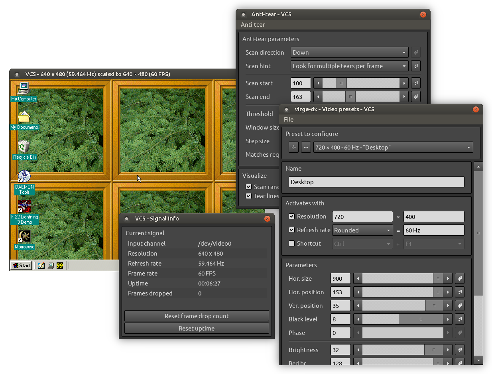
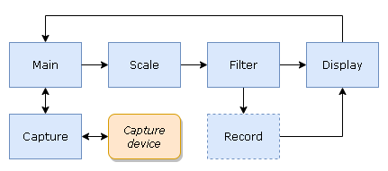

# VCS

A third-party capture tool for Datapath's VisionRGB range of capture cards. Greatly improves the hardware's suitability for capturing dynamic VGA signals (e.g. of retro PCs) compared to Datapath's bundled capture software.

VCS interfaces with compatible capture device to display the capture output in a window on your desktop. Additionally, you can apply filters, scalers, anti-tearing, and various other adjustments to the output before it's displayed.

\
*A screenshot of VCS 2.4 showing the capture window (in the background) and some of the control dialogs.*

## Features

- Capture functionality tailored for the Datapath VisionRGB series of capture cards, and especially for the VisionRGB-PRO
- Run-time image filtering (blur, crop, decimate, denoise, etc.)
- Frame scaling with nearest, linear, area, cubic, and Lanczos sampling
- Host-side triple buffering to reconstruct torn frames
- On-screen display customizable with HTML/CSS
- Output in software and OpenGL (with variable refresh rate)
- Support for Windows (XP and later) and Linux (experimental)
- Virtual machine friendly: minimal reliance on GPU features

## Supported capture hardware

VCS is compatible with at least the following Datapath capture cards:
- VisionRGB-PRO1
- VisionRGB-PRO2
- VisionRGB-E1
- VisionRGB-E2
- VisionRGB-E1S
- VisionRGB-E2S
- VisionRGB-X2

The VisionAV range of cards should also work, albeit without their audio capture functionality.

## Manuals

### User's manual

The VCS user's manual is available for the following versions of VCS:

- [master branch](https://www.tarpeeksihyvaesoft.com/vcs/docs/user-manual/) (includes changes not yet released in a versioned distributable)
- [2.5.2](https://www.tarpeeksihyvaesoft.com/vcs/docs/user-manual/2.5.2/)
- [2.5.1](https://www.tarpeeksihyvaesoft.com/vcs/docs/user-manual/2.5.1/)
- [2.5.0](https://www.tarpeeksihyvaesoft.com/vcs/docs/user-manual/2.5.0/)
- [2.4.0](https://www.tarpeeksihyvaesoft.com/vcs/docs/user-manual/2.4.0/)

### Developer's manual

- [Pre-compiled](https://www.tarpeeksihyvaesoft.com/vcs/docs/developer-manual/) (updated with a delay)
- [Source](./docs/developer-manual/)

## Building

Run `$ qmake && make` in the repo's root; or open [vcs.pro](vcs.pro) in Qt Creator. See also [Dependencies](#dependencies).

I use the following toolchains when working on VCS &ndash; sticking close to them should give you the least number of compatibility issues:

| OS      | Compiler           | Qt   |
| ------- | ------------------ | ---- |
| Linux   | GCC 9.4 (64-bit)   | 5.12 |
| Windows | MinGW 5.3 (32-bit) | 5.7  |

Windows is VCS's primary platform for distribution, and the codebase needs to remain compatible with the Windows toolchain.

### Release build vs. debug build

The default configuration in [vcs.pro](vcs.pro) produces a debug build, with &ndash; among other things &ndash; more copious run-time bounds-checking of memory accesses. The run-time debugging features are expected to reduce performance to some extent, but can help reveal programming errors.

Defining `RELEASE_BUILD` globally will produce a release build, with fewer debugging checks in performance-critical sections of the program. Simply uncomment `DEFINES += RELEASE_BUILD` at the top of [vcs.pro](vcs.pro) and execute a full rebuild.

To confirm whether the program is running in release or debug mode, check the About dialog (right-click VCS's output window and select "About VCS&hellip;"). For debug builds, the program's version will be reported as "VCS x.x.x (non-release build)", whereas for release builds it'll be "VCS x.x.x".

### The capture backend

A capture backend in VCS is an implementation providing support for a particular capture device. For example, Datapath's VisionRGB capture cards are supported in VCS on Windows by the [RGBEasy capture backend](./src/capture/rgbeasy/), which uses the Datapath RGBEasy API.

One (and only one) capture backend must be active in any build of VCS. To select which one it is, set its identifier in the `DEFINES` variable in [vcs.pro](vcs.pro). By default, VCS uses Datapath's RGBEasy (CAPTURE_BACKEND_RGBEASY) on Windows and Vision (CAPTURE_BACKEND_VISION_V4L) on Linux, supporting the VisionRGB range of capture cards on those platforms.

The following capture backends are available:

| Identifier                  | Explanation |
| --------------------------- | ----------- |
| CAPTURE_BACKEND_RGBEASY     | Supports the Datapath VisionRGB range of capture cards on Windows; requires the Datapath VisionRGB driver to be installed. If used when building on Linux, will provide a debug implementation that announces in the terminal which RGBEasy API functions would be called if you were to run the program on Windows. |
| CAPTURE_BACKEND_VISION_V4L  | Supports the Datapath VisionRGB range of capture cards on Linux; requires the Datapath Vision driver to be installed. |
| CAPTURE_BACKEND_VIRTUAL     | Provides a device-independent capture source that generates a test image. Useful for debugging, and doesn't require capture drivers to be installed. |
| CAPTURE_BACKEND_DOSBOX_MMAP | Allows capturing DOSBox's frame buffer on Linux. Intended for debugging. See [this blog post](https://www.tarpeeksihyvaesoft.com/blog/capturing-dosboxs-frame-buffer-via-shared-memory/) for details.|

### Dependencies

The VCS codebase depends on the following external libraries and frameworks:

1. Qt
2. OpenCV
3. Datapath capture API (RGBEasy on Windows, Vision/Video4Linux on Linux)

It's possible to build VCS with just Qt and none of the other dependencies by modifying certain flags in [vcs.pro](vcs.pro) (see the sections below for details), although this will generally produce a very feature-stripped version of the program.

#### Qt

VCS uses [Qt](https://www.qt.io/) for its GUI and certain other functionality. Qt >= 5.7 or newer should satisfy the requirements.

Non-GUI code interacts with the GUI through a wrapper interface ([src/display/display.h](src/display/display.h), instantiated for Qt in [src/display/qt/d_main.cpp](src/display/qt/d_main.cpp)). If you wanted to implement the GUI with something other than Qt, you could do that by creating a new wrapper that implements this interface.

**Note:** There's currently some bleeding of Qt functionality into non-GUI regions of the codebase, which you would need to deal with also if you wanted to fully excise Qt.

#### OpenCV

VCS uses the [OpenCV](https://opencv.org/) 3.2.0 library for image filtering/scaling and video recording. For Windows, the binary distribution of VCS includes a pre-compiled DLL compatible with MinGW 5.3. For Linux, you can get the OpenCV 3.2.0 source code [here](https://github.com/opencv/opencv/tree/3.2.0) and follow the build instructions [here](https://docs.opencv.org/3.2.0/d7/d9f/tutorial_linux_install.html) (maybe also see [this](https://stackoverflow.com/questions/46884682/error-in-building-opencv-with-ffmpeg) in case of build errors).

#### Datapath RGBEasy

On Windows, VCS uses the Datapath RGBEasy 1.0* API to interface with your VisionRGB capture device. The drivers for your Datapath capture card should include the required libraries, though you may need to adjust the paths to them in [vcs.pro](vcs.pro).

\*As distributed with the VisionRGB-PRO driver package v8.1.2.

To remove VCS's the dependency on RGBEasy, replace `CAPTURE_BACKEND_RGBEASY` with `CAPTURE_BACKEND_VIRTUAL` in [vcs.pro](vcs.pro). This will also disable capturing, but will let you run the program without the Datapath drivers/dependencies installed.

#### Datapath Vision

On Linux, VCS uses the Datapath Vision driver to interface with Datapath capture devices. You'll need to download and install the kernel module driver from Datapath's website (and re-install it every time your kernel updates).

To remove VCS's the dependency on the Datapath Vision driver, replace `CAPTURE_BACKEND_VISION_V4L` with `CAPTURE_BACKEND_VIRTUAL` in [vcs.pro](vcs.pro). This will also disable capturing, but will let you run the program without the drivers installed.

## Program flow

VCS is a mostly single-threaded application whose event loop is synchronized to the capture device's rate of output. In general, VCS's main loop polls the capture device until a capture event (e.g. new frame) occurs, then processes the event, and returns to the polling loop.

 The above diagram shows a general step-by-step view of VCS's program flow. `Capture` communicates with the capture device (which will typically be running in its own thread), receiving frame data and setting hardware-side capture parameters. `Main` polls `Capture` to receive information about capture events. When it receives a new frame from `Capture`, `Main` sends the frame's data to `Scale` for scaling, which then forwards it to `Filter` for image filtering, which in turn sends it to `Record` to be appended into a video file (if video recording is enabled) and then to `Display` to be rendered onto VCS's output window.

| System  | Corresponding source code          |
| ------- | ---------------------------------- |
| Main    | [src/main.cpp](./src/main.cpp)     |
| Capture | [src/capture/*](./src/capture/)    |
| Scale   | [src/scaler/*](./src/scaler/)      |
| Filter  | [src/filter/*](./src/filter/)      |
| Record  | [src/record/*](./src/record/)      |
| Display | [src/display/*](./src/display/)    |
