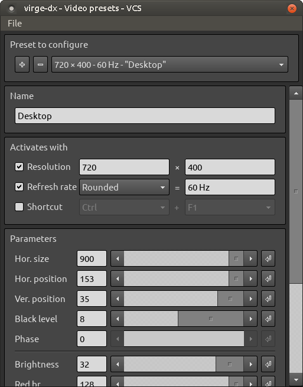
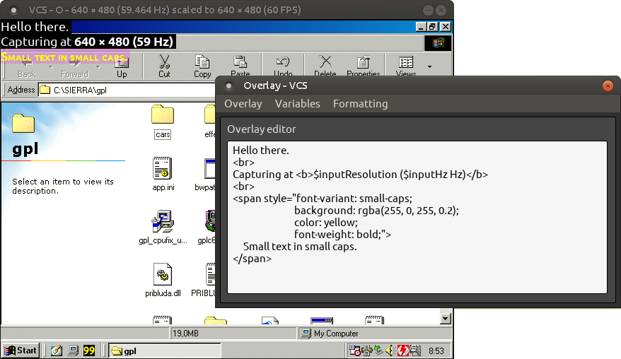
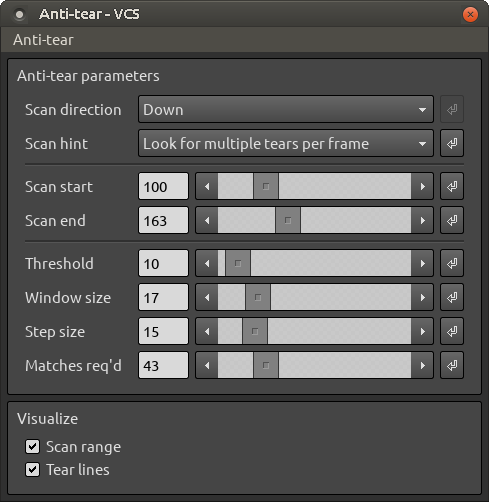
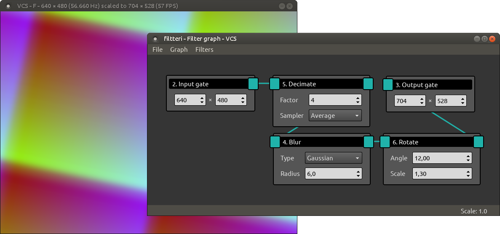

# VCS
A third-party capture tool for Datapath's VisionRGB range of capture cards. Greatly improves the hardware's suitability for capturing dynamic VGA signals (e.g. of retro PCs) compared to Datapath's bundled capture software.

VCS interfaces with compatible capture device to display the capture output in a window on your desktop. Additionally, you can apply filters, scalers, anti-tearing, and various other adjustments to the output before it's displayed. A more complete list of VCS's features is given below.

### Features
- Real-time customizable frame filters: blur, crop, decimate, denoise, ...
- Scaling with nearest, linear, area, cubic, and Lanczos sampling
- System-side triple buffering that fixes existing frame tearing
- Custom overlays with HTML/CSS formatting
- Video recording
- Virtual machine friendly - low reliance on GPU features
- Outputs in software and OpenGL
- Windows (XP and later), Linux (experimental)

### Hardware support
VCS is compatible with at least the following Datapath capture cards:
- VisionRGB-PRO1
- VisionRGB-PRO2
- VisionRGB-E1
- VisionRGB-E2
- VisionRGB-E1S
- VisionRGB-E2S
- VisionRGB-X2

The VisionAV range of cards should also work, albeit without their audio capture functionality.

# User's manual

This is the user's manual for VCS 2.4.

## Table of contents
- [Setting up](#setting-up)
- [Output window](#output-window)
    - Magnifying glass
    - Dragging
    - Borderless mode
    - Fullscreen mode
    - Resizing
    - Scaling with the mouse wheel
    - Title bar
    - Menu bar
- [Dialogs](#dialogs)
    - Video & color dialog
    - Alias resolutions dialog
    - Record dialog
    - Input resolution dialog
    - Output resolution dialog
    - Anti-tear dialog
    - Filter graph dialog
- [Mouse and keyboard shortcuts](#mouse-and-keyboard-shortcuts)
- [Command-line arguments](#command-line-arguments)

## Setting up
Assuming you've installed the drivers for your capture device, as well as unpacked the binary distribution of VCS (linked to, above) into a folder, getting VCS going is simply a matter of running its `vcs.exe` executable.

When you run the executable, two windows will open: a console window, in which notifications about VCS's status will appear during operation; and the [output window](#output-window), in which captured frames are displayed.

- Note: You can launch `vcs.exe` with command-line parameters to automate certain start-up tasks. A list of the command-line options is given in the [command-line](#command-line-arguments) section.

When running VCS for the first time, the first thing you may want to do is adjust the capture video parameters, like phase, color balance, and so on. These can be set up via the [video & color dialog](#video-&-color-dialog).

## Output window
The central point of the VCS user interface is the output window, where captured frames are displayed as they arrive from the capture device and having undergone any of VCS's filtering and scaling.

\
*The output window - showing a Windows 98 desktop being captured on Linux.*

### Magnifying glass
If you press the middle mouse button over the output window, a magnifying glass will pop up, showing an elarged view of the area around the cursor.

- Note: The magnifying glass is not available with the OpenGL renderer.

### Dragging
You can drag the output window by left-clicking and holding anywhere on the window.

### Borderless mode
You can double-click inside the output window to toggle borderless mode on/off. The F1 keyboard shortcut will also toggle this mode.

### Resizing
The output window - along with the frames it's displaying - can be resized via the [Output resolution dialog](#output-resolution-dialog). Spinning the mouse scroll wheel over the output window will also adjust the output size.

### Fullscreen mode
Although you can emulate a fullscreen mode by turning off the output window's border (see [Borderless mode](#borderless-mode)) and then scaling the window to the size of the the display area (see [Resizing](#resizing)), there's also a true fullscreen mode available. You can toggle it on/off with the F11 shortcut key.

- Note: For the fullscreen mode to work best, you may first need to manually resize the output window to match the resolution of your screen (see [Resizing](#resizing)).

### Title bar
The output window's title bar shows information about VCS's current operating state; e.g. the input and output resolution.

The title bar may contain some or all of the following elements, from left to right:

- `{!}`: Frame drop indicator; shown when VCS is having to drop captured frames (due to e.g. insufficient CPU performance).
- `VCS`: The program's name
- `R` `F` `O` `A`: Indicators for whether certain functionality is enabled.
    - `R`: Video recording (see [Record dialog](#record-dialog)).
    - `F`: Filter graph (see [Filter graph dialog](#filter-graph-dialog)).
    - `O`: Overlay (see [Overlay dialog](#overlay-dialog)).
    - `A`: Anti-tearing (see [Anti-tear dialog](#anti-tear-dialog)).
- `640 x 480 (60 Hz)`: The current capture resolution and its refresh rate.
- `scaled to 704 x 528 (60 FPS)`: The current output resolution and VCS's frame rate.

Under special circumstances, the title bar may also show one of these messages:

- `VCS - No signal`: The capture device doesn't appear to be receiving a signal.
- `VCS - Signal out of range`: Either VCS or the capture device is unable to process the current video mode. For VCS, the maximum capture resolution is 1920 &times; 1080.
- `VCS - Invalid capture channel`: The requested capture channel on the capture device is unavailable for use.

You can also set a fully custom window title via the `Context menu` &rarr; `Window` &rarr; `Set title...` context menu option (See [Context menu](#context-menu)).

### Context menu
Right-clicking inside the output window will bring up its context menu, which gives you access to the various controls and dialogs of VCS.

####  Eye dropper

The eye dropper is a special non-interactible element of the context menu. It shows the RGB color values of the pixel over which the context menu was opened.

#### Input
`Context menu` &rarr; `Input` &rarr; `Channel`

Set the hardware capture channel.

`Context menu` &rarr; `Input` &rarr; `Color depth`

Set the color depth with which frames are captured. This is a hardware-level setting: the capture device will convert each frame to this color depth before uploading it to system memory - thus lower color depths consume less bandwidth. Prior to display, VCS will convert the frames to the color depth of the [output window](#output-window).

`Context menu` &rarr; `Input` &rarr; `De-interlacing`

Set the de-interlacing mode for interlaced signals. This is a hardware-level setting. Will have no effect on non-interlaced signals (even if the captured frames exhibit interlacing).

`Context menu` &rarr; `Input` &rarr; `Dialogs` &rarr; `Aliases`

Open the [Alias resolutions](#alias-resolutions-dialog) dialog.

`Context menu` &rarr; `Input` &rarr; `Dialogs` &rarr; `Resolution`

Open the [Input resolution](#input-resolution-dialog) dialog.

`Context menu` &rarr; `Input` &rarr; `Dialogs` &rarr; `Signal info`

Open the Signal info dialog.
 
`Context menu` &rarr; `Input` &rarr; `Dialogs` &rarr; `Video presets`

Open the [Video presets](#video-presets-dialog) dialog.

#### Output
`Context menu` &rarr; `Output` &rarr; `Screenshot...`

Save the current output image into an image file.

`Context menu` &rarr; `Output` &rarr; `Aspect ratio`

Set the aspect ratio to display captured frames in. Letterboxing will be used to achieve the desired ratio.

- `Native`: Display frames in the full size of the [output window](#output-window), without letterboxing.
- `Traditional 4:3`: Use 4:3 aspect ratio for resolutions that historically might have been meant to be displayed as such. These include 720 x 400, 640 x 400, and 320 x 200.
- `Always 4:3`: Display all frames in 4:3 aspect ratio.

`Context menu` &rarr; `Output` &rarr; `Upscaler`\
Set the scaler to be used when frames are upscaled to fit the [output window](#output-window).

`Context menu` &rarr; `Output` &rarr; `Downscaler`\
Set the scaler to be used when frames are downscaled to fit the [output window](#output-window).

`Context menu` &rarr; `Output` &rarr; `Dialogs` &rarr; `Overlay`\
Open the [Overlay](#overlay-dialog) dialog.

`Context menu` &rarr; `Output` &rarr; `Dialogs` &rarr; `Anti-tear`\
Open the [Anti-tear](#anti-tear-dialog) dialog.

`Context menu` &rarr; `Output` &rarr; `Dialogs` &rarr; `Resolution`\
Open the [Output resolution](#output-resolution-dialog) dialog.

`Context menu` &rarr; `Output` &rarr; `Dialogs` &rarr; `Filter graph`\
Open the [Filter graph](#filter-graph-dialog) dialog.

`Context menu` &rarr; `Output` &rarr; `Dialogs` &rarr; `Video recorder`\
Open the [Record](#record-dialog) dialog.

#### Window
`Context menu` &rarr; `Window` &rarr; `Renderer`\
Set the type of rendering VCS uses to draw captured frames onto the [output window](#output-window).

- `Software`: Most compatible option. Rendering is done on the CPU.
- `OpenGL`: Rendering is done on the GPU using OpenGL.

When choosing the renderer, be mindful of the following:
- The OpenGL renderer might not work in Windows XP.
- The output window's magnifying glass feature is not available with the OpenGL renderer.

`Context menu` &rarr; `Window` &rarr; `Border`\
Set whether the [output window](#output-window) should be drawn with a border.

`Context menu` &rarr; `Window` &rarr; `Fullscreen`\
Place the [output window](#output-window) into fullscreen mode. For best results, you should first scale the window to the resolution of your screen before making it fullscreen.

Note: The fullscreen feature may not work properly on certain distributions of Linux.

`Context menu` &rarr; `Window` &rarr; `Center`\
Snap the [output window](#output-window) into the middle of the screen.

`Context menu` &rarr; `Window` &rarr; `Top left`\
Snap the [output window](#output-window) into the top left corner of the screen.

`Context menu` &rarr; `Window` &rarr; `Set title...`\
Give the [output window](#output-window) a custom title. All of VCS's normal title bar information - except the frame drop indicator - will be replaced with the text you set.

You could, for instance, set the title to "Tomb Raider" if you're capturing footage of Tomb Raider.

Setting an empty text will restore VCS's default title bar.

#### Miscellanous
`Context menu` &rarr; `About...`\
Display information about VCS and the capture device.

## Dialogs
The VCS user interface includes a number of dialogs, with which you can adjust the program's operational parameters.

- [Video presets dialog](#video-presets-dialog)
- [Alias resolutions dialog](#alias-resolutions-dialog)
- [Video record dialog](#video-record-dialog)
- [Input resolution dialog](#input-resolution-dialog)
- [Output resolution dialog](#output-resolution-dialog)
- [Anti-tear dialog](#anti-tear-dialog)
- [Filter graph dialog](#filter-graph-dialog)

### Video presets dialog
To access: Ctrl+V or [Context menu](#context-menu) &rarr; `Input` &rarr; `Dialogs` &rarr; `Video presets`

The video presets dialog lets you to modify the capture devices's video signal parameters.

\
*The video presets dialog - showing controls for adjusting the capture device's video signal parameters.*

A given video preset's parameters will be applied when all of its "Activates with" conditions are met. For instance, if you've defined a preset's activation resolution as 800 x 600 and have disabled the other activating conditions, the preset's parameters will be applied when the capture video mode is 800 x 600.

To add or delete a preset, click the + or - buttons next to the preset selector at the top of the dialog. Clicking the + button while holding the Alt key will create a new preset with the current preset's settings.

If you want your changes to the video presets to persist after you exit VCS, remember to save them first! This can be done via `File` &rarr; `Save as...`. Saved settings can be restored via `File` &rarr; `Open...`. Any saved settings that're open when VCS exits will be reloaded automatically when you run VCS again.

### Alias resolutions dialog
To access: [Context menu](#context-menu) &rarr; `Input` &rarr; `Dialogs` &rarr; `Aliases...`

With the alias resolutions dialog, you can instruct VCS to automatically override certain capture resolutions.

For instance, if you find that your capture device is displaying 640 &times; 400 as 512 &times; 488 (or something to that effect), you can define 640 &times; 400 as an alias of 512 &times; 488. Whenever the capture device reports a new video mode of 512 &times; 488, VCS will tell the device to use 640 &times; 400, instead.

### Video record dialog
To access: Ctrl+R or [Context menu](#context-menu) &rarr; `Output` &rarr; `Dialogs` &rarr; `Video recorder...`

The video recorder gives you the option to stream captured frames into a video file.

To use the video recorder in Windows, you'll need to install the 32-bit version of the [x264vfw](https://sourceforge.net/projects/x264vfw/files/x264vfw/44_2851bm_44825/) codec and run its configurator at least once, so that its settings are added into the Windows registry for VCS to find.

The recorder will write frames as they appear in the [output window](#output-window) into a video file, with the following caveats:

- Audio won't be recorded.
- Frames will be inserted into the video at the rate of capture; the recorder doesn't try to maintain any particular frame rate (e.g. by duplicating or dropping frames). For example, if your capture source is 57.5 Hz, one minute of video will have 57.5 * 60 frames, and if that video is played back at 60 FPS, it will appear slightly sped up.
- If VCS drops any frames during recording (e.g. due to insufficient system performance), the video's playback will be non-linear. So if you're recording a separate audio file and are planning to sync it with the video, you want there to be no frames dropped while recording the video.
- The video will be recorded in the H.264 format using an x264 codec.
- The video resolution will be that of the current output size (see [Output resolution dialog](#output-resolution-dialog)).
- The output size can't be changed while recording; all frames will be scaled automatically to fit the current size.
- The [overlay](#overlay-dialog) won't be recorded.
- Encoder parameters influencing image quality (e.g. CRF) can't be customized in the Linux version of VCS. This is a limitation of OpenCV. You can, however, modify and recompile the OpenCV code with higher-quality default options (see e.g. [here](https://www.researchgate.net/post/Is_it_possible_to_set_the_lossfree_option_for_the_X264_codec_in_OpenCV)).

#### Recorder settings
**Nominal FPS.** The video's suggested playback rate. This setting doesn't affect the recording rate, only the rate at which the video might be played back by your video player. The actual recording FPS will be determined by the capture source's refresh rate.

**Additional x264 arguments.** You put down in this field any custom x264 command-line arguments.

For best image quality regardless of performance and/or file size, you can try the following settings:

- `Profile: High 4:4:4`
- `Pixel format: RGB`
- `CRF: 0`
- `Preset: Ultrafast`

To reduce file size while maintaining high image quality, you can set `Preset` to "Veryfast" or "Faster" and increase `CRF` to 10-15. For more tips and tricks, you can look up documentation specific to the x264 encoder.

If the recorder dialog indicates that frames are being dropped while recording, try to select recording options that require less CPU or IO performance.
- Dragging or otherwise interacting with GUI items (e.g. dialog windows) during recording may cause transient frame drops.
- During recording, frames will be saved to disk in batches. If you get a bunch of frames dropped every couple of seconds but no drops otherwise, insufficient disk performance may be the reason (i.e. writing the batch of frames takes too long).

### Input resolution dialog
To access: Ctrl+I or [Context menu](#context-menu) &rarr; `Capture` &rarr; `Dialogs` &rarr; `Resolution...`

Not available on Linux.

Normally, the capture device will automatically set the capture resolution to match that of the input signal, but sometimes the result isn't quite right. The input resolution dialog lets you override this resolution with your own one.

You can change a button's assigned resolution by clicking on it while pressing the Alt key.

### Output resolution dialog
To access: Ctrl+O or [Context menu](#context-menu) &rarr; `Output` &rarr; `Dialogs` &rarr; `Resolution...`

The output resolution dialog lets you resize the output window. This also resizes the frames being displayed in the window.

- Note: The output resolution controls are not available while recording video (see [Video record dialog](#video-record-dialog)).

#### Settings

**Resolution.** Lock the size of the output window so that changes to the capture resolution don't affect the output resolution. Frames will be scaled up or down as needed to match this resolution.

**Relative scale.** Scale the size of the output window up or down by a percentage of its base size. The base size is either the capture resolution, or, if enabled, the locked output resolution.

### Overlay dialog
To access: Ctrl+L or [Context menu](#context-menu) &rarr; `Output` &rarr; `Dialogs` &rarr; `Overlay...`

The overlay dialog lets you define a message to be overlaid on the [output window](#output-window).

\
*The overlay dialog - showing controls for overlaying a message on the output window.*

You can combine normal text with pre-set VCS variables and HTML/CSS formatting to create a message to be shown over the output window.

### Anti-tear dialog
To access: Ctrl+A or [Context menu](#context-menu) &rarr; `Output` &rarr; `Dialogs` &rarr; `Anti-tear...`

The anti-tear dialog provides functionality to remove tearing from captured frames.

\
*The anti-tear dialog - showing controls for adjusting the parameters of VCS's anti-tear engine.*

Under some circumstances, like when the captured source doesn't sync its rendering with the refresh rate, captured frames can contain tearing. VCS's anti-tearer helps mitigate this issue.

Anti-tearing should be considered an experimental feature of VCS. It works well in some cases and not that well in others. It'll completely fail to work if the captured source redraws the screen at a rate higher than the capture's refresh rate - e.g. a game running at 100 FPS with a refresh of 60 Hz.

#### Settings

**Scan start.** Set where the anti-tearer begins scanning each frame for tears. Static screen-wide content like a game's UI bar can prevent the anti-tearing from working, so you should set this value so that such content is excluded. You can choose to visualize the scan range to help you set it up.

**Scan end.** Same as **Scan start** but for where the scanning should end. This is an offset from the bottom of the screen up, so e.g. a value of 5 at a resolution of 640 &times; 480 would mean the scanning ends at pixel row 475.

**Scan direction.** If the captured source redraws its screen from bottom to top, set the scan direction to `Down`. Otherwise, use the `Up` setting. Using the wrong direction will fully prevent the anti-tearing from working (it may correctly detect tears but won't be able to remove them).

**Scan hint.** If the captured source redraws its screen at a rate higher than half of its refresh rate but lower than the full refresh rate (e.g. 35 FPS at 60 Hz), you may (or might not) have better results and/or performance by setting this option to `Look for one tear per frame`. Otherwise, use the `Look for multiple tears per frame` setting.

**Visualization.** Draw certain anti-tearing-related markers in the [output window](#output-window).

**Threshold.** The anti-tearer compares adjacent frames to find which parts of the new frame may be torn (where pixels from the previous frame are still visible). This setting controls the amount by which a pixel's color values are allowed to change between frames without the pixel being considered new (given inherent noise in analog pixels). In an ideal situation where there's no noise in the captured signal, you can set this to 0 or close to it. Otherwise, the value should be high enough to exclude capture noise.

**Window size.** When scanning frames for tears, the anti-tearer will average together a bunch of horizontal pixels' color values to reduce the negative effect of analog noise. This setting controls the pixel size of the sampling window. Lower values will result in better performance but possibly worse tear detection.

**Step size.** The number of pixels to skip horizontally when scanning for tears. Higher values will improve performance but may cause a failure to detect subtler tears.

**Matches req'd.** Set how many times the sampling window must find a pixel's color values to have exceeded the detection threshold for a horizontal row of pixels to be considered new relative to the previous frame. Higher values should reduce the chance of false positives but may also cause a failure to detect subtler tears.

### Filter graph dialog
To access: Ctrl+F or [Context menu](#context-menu) &rarr; `Output` &rarr; `Dialogs` &rarr; `Filter graph...`

The filter graph dialog lets you to create chains of image filters to be applied to captured frames prior to display in the [output window](#output-window).

\
*The filter graph dialog - showing controls for creating and modifying filter chains.*

The filter graph is made up of nodes that can be connected together in a chain. These nodes come in three varieties: `input gate`, `output gate`, and `filter`.

The input and output gates determine the resolutions for which the connected filters will be applied. For instance, if you set an input gate's width and height to 640 and 480, and the width and height of an output gate to 1920 and 1080, any filters you connect between these two nodes will be applied when the size of the output window is 1920 x 1080 and the original resolution of the frames (i.e. the capture resolution) is 640 x 480. You can also use the value 0 for a gate's width and/or height to allow VCS to match any value to that dimension: an input gate with a width and height of 0, for instance, will apply the connected filters to frames of all capture resolutions, provided that they also meet the resolution specified for the output gate. A filter graph can have multiple chains of these input-filter-output combos, and VCS will select the most suitable one (or none) given the current capture and output resolutions.

- Note: When deciding which of multiple filter chains to use, VCS will prefer more specific chains to more general ones. If you have e.g. an input gate whose width and height are 0, and another input gate whose width and height are 640 and 480, the latter will be used when the capture resolution is exactly 640 x 480, and the former otherwise. Likewise, if your input gates are 0 x 0 and 640 x 0, the former will be applied for capture resolutions of *any* x *any*, except for 640 x *any*, where the latter chain will apply - except if you also have a third input gate of 640 x 480, in which case that will be used when the capture resolution is exactly 640 x 480.

To connect two nodes, click and drag with the left mouse button from one node's output edge (square) to another's input edge (circle), or vice versa. A node can be connected to as many other nodes as you like. To disconnect a node from another, right-click on the node's output edge, and select the other node from the list that pops up. To remove a node itself from the graph, right-click on the node and select to remove it. To add nodes to the graph, select `Add` from the dialog's menu bar.

## Mouse and keyboard shortcuts
You can make use of the following mouse and keyboard shortcuts:

**Double-click VCS's output window**\
Toggle window border on/off.

**Middle-click the output window**\
Magnify this portion of the output window.

**Left-click and drag the output window**\
Move the window (same as dragging by its title bar).

**Right-click the output window**\
Open the context menu.

**Mouse wheel over the output window**\
Scale the output window up/down.

**F11**\
Toggle fullscreen mode on/off.

**Ctrl + A**\
Open the anti-tear dialog.

**Ctrl + F**\
Open the filter graph dialog.

**Ctrl + V**\
Open the video settings dialog.

**Ctrl + I**\
Open the input resolution dialog.

**Ctrl + O**\
Open the output resolution dialog.

**Ctrl + R**\
Open the record dialog.

**Ctrl + L**\
Open the overlay dialog.

**Ctrl + Shift + key**\
Toggle the corresponding dialog's functionality on/off; e.g. Ctrl + Shift + R to turn recording on/off.

**Ctrl + 1...9**\
Shortcuts for the input resolution buttons on the control panel's Input tab.

**Shift + 1...2**\
Set the input channel index.

## Command-line arguments
Optionally, you can pass one or more of following command-line arguments when launching VCS:

`-i <input channel>`
- Start capture on the given input channel (1...*n*). On Linux, a value of 1 corresponds to /dev/video0, 2 to /dev/video1, 3 to /dev/video2, etc. By default, channel #1 will be used.

`-v <path + filename>`
- Load video presets from the given file on start-up. Video preset files typically have the .vcs-video suffix.

`-f <path + filename>`
- Load a custom filter graph from the given file on start-up. Filter graph files typically have the .vcs-filter-graph suffix.

`-a <path + filename>`
- Load alias resolutions from the given file on start-up. Alias resolution files typically have the .vcs-alias suffix.

`-m <value in MB>`
- Set the amount of system memory that VCS reserves on startup. If you're getting error messages about the memory cache running out, increase this value. If you get x264 allocation errors when attempting to record video, try reducing this value. Default: 256 MB.

For example, if you had capture parameters stored in the file `params.vcsm`, and you wanted capture to start on input channel #2 when you run VCS, you might launch VCS like so:
```
vcs.exe -v "params.vcs-video" -i 2
```

# Developer's manual

## Building
**On Linux:** Do `qmake && make` at the repo's root, or open [vcs.pro](vcs.pro) in Qt Creator.

**On Windows:** Same as for Linux.

While developing VCS, I've been compiling it with GCC 5-9 on Linux and MinGW 5.3 on Windows, and my Qt has been version 5.5-5.9 on Linux and 5.7 on Windows. If you're building VCS, sticking with these tools should guarantee the least number of compatibility issues.

### Build dependencies
**Qt.** VCS uses [Qt](https://www.qt.io/) for its GUI and certain other functionality. Qt >= 5.7 or newer should satisfy VCS's requirements. The binary distribution of VCS for Windows includes the required DLLs.
- Non-GUI code interacts with the GUI through a wrapper interface ([src/display/display.h](src/display/display.h), instantiated for Qt in [src/display/qt/d_main.cpp](src/display/qt/d_main.cpp)). If you wanted to implement the GUI with something other than Qt, you could do so by creating a new wrapper that implements this interface.
    - There is, however, currently some bleeding of Qt functionality into non-GUI regions of the codebase, which you would need to deal with also if you wanted to fully excise Qt. Namely, in the units [src/record/record.cpp](src/record/record.cpp), [src/common/disk.cpp](src/common/disk.cpp), and [src/common/csv.h](src/common/csv.h).

**OpenCV.** VCS makes use of the [OpenCV](https://opencv.org/) 3.2.0 library for image filtering/scaling and video recording. For Windows, the binary distribution of VCS includes a pre-compiled DLL compatible with VCS and MinGW 5.3. For Linux, you can get the OpenCV 3.2.0 source code [here](https://github.com/opencv/opencv/tree/3.2.0) and follow the build instructions [here](https://docs.opencv.org/3.2.0/d7/d9f/tutorial_linux_install.html) (maybe also see [this](https://stackoverflow.com/questions/46884682/error-in-building-opencv-with-ffmpeg) in case of build errors).
- The dependency on OpenCV can be removed by undefining `USE_OPENCV` in [vcs.pro](vcs.pro). If undefined, most forms of image filtering and scaling will be unavailable, and video recording will not be possible.
- Q: Why does VCS use such an old version of OpenCV? A: To maintain compatibility with Windows XP (useful for e.g. virtual machines).

**RGBEasy.** On Windows, VCS uses Datapath's RGBEasy 1.0 API to interface with the capture device. The drivers for your Datapath capture card should include and have installed the required libraries, though you may need to adjust the paths to them in [vcs.pro](vcs.pro).
- If you want to remove VCS's the dependency on RGBEasy, replace `CAPTURE_DEVICE_RGBEASY` with `CAPTURE_DEVICE_VIRTUAL` in [vcs.pro](vcs.pro). This will also disable capturing, but will let you run the program without the Datapath drivers/dependencies installed.
- The specific RGBEASY headers and libraries used to build the official version of VCS come from the VisionRGB-PRO driver package v8.1.2.
- Q: Why does VCS use such an old version of the RGBEasy API? A: To support the VisionRGB-PRO.

**Video4Linux.** On Linux, VCS uses Datapath's Video4Linux driver to interface with the capture device. For this to work, you should install the latest Datapath Vision Linux driver (may not support kernel 5+).
- If you want to remove VCS's the dependency on the Video4Linux driver, replace `CAPTURE_DEVICE_VISION_V4L` with `CAPTURE_DEVICE_VIRTUAL` in [vcs.pro](vcs.pro). This will also disable capturing, but will let you run the program without the Datapath drivers installed.

## Code organization
VCS is largely a single-threaded application whose event loop is synchronized to the capture devices's rate of operation. VCS's main loop polls the capture device (which may run in a separate thread) until a capture event (e.g. new frame) occurs, then processes the event, and returns to the polling loop.

```
.--> MAIN <--> CAPTURE <-- [Capture device]
|     |
|     v
|    SCALE
|     |
|     v 
|    FILTER
|     |
|     +--> RECORD
|     |
|     v
`--- DISPLAY
```

In the above diagram, MAIN polls CAPTURE, which returns information to MAIN about capture events. When it receives a new frame from CAPTURE, MAIN sends the frame data to SCALE for scaling, to FILTER for image filtering, and finally to DISPLAY for the scaled and filtered frame be rendered on screen - and optionally to RECORD for recording the frame into a video file.

The modules marked in uppercase in the above diagram correspond to source code files roughly like so:

| Module  | Source                             |
| ------- | ---------------------------------- |
| Main    | [src/main.cpp](src/main.cpp)       |
| Capture | [src/capture/](src/capture/)       |
| Scale   | [src/scaler/](src/scaler/)         |
| Filter  | [src/filter/](src/filter/)         |
| Record  | [src/record/](src/record/)         |
| Display | [src/display/](src/display/)       |

# Project status
VCS is currently in post-1.0, having come out of beta in 2018. Development is sporadic.

### System requirements
You are encouraged to have a fast CPU, since most of VCS's operations are performed on the CPU. The GPU is of less importance, and even fairly old ones will likely work. VCS uses roughly 1 GB of RAM, and so your system should have at least that much free - preferably twice as much or more.

**Performance.** On my Intel Xeon E3-1230 v3, VCS performs more than adequately. The table below shows that an input of 640 x 480 can be scaled to 1920 x 1440 at about 300-400 frames per second, depending on the interpolation used.

| 640 x 480    | Nearest | Linear | Area | Cubic | Lanczos |
| ------------ |:-------:|:------:|:----:|:-----:|:-------:|
| 2x upscaled  | 1100    | 480    | 480  | 280   | 100     |
| 3x upscaled  | 460     | 340    | 340  | 180   | 50      |

Drawing frames onto the [output window](#output-window) using software rendering is likewise sufficiently fast, as shown in the following table. An input of 640 x 480 can be upscaled by 2x and drawn on screen at roughly 340 frames per second when using nearest-neighbor interpolation.

| 640 x 480       | 1x<br>Nearest | 2x<br>Nearest | 3x<br>Nearest |
| --------------- |:-------------:|:-------------:|:-------------:|
| With display    | 1360          | 340           | 150           |
| Without display | 1910          | 1100          | 510           |

Padding (i.e. aspect ratio correction) can incur a performance penalty with some of the scalers. The following table shows the frame rates associated with scaling a 640 x 480 input into 1920 x 1080 with and without padding to 4:3.

| 480p to 1080p | Nearest | Linear | Area | Cubic | Lanczos |
| ------------- |:-------:|:------:|:----:|:-----:|:-------:|
| Padded / 4:3  | 390     | 270    | 270  | 200   | 80      |
| No padding    | 820     | 370    | 370  | 210   | 70      |

# Authors and credits
The primary author of VCS is the one-man Tarpeeksi Hyvae Soft (see on [GitHub](https://github.com/leikareipa) and the [Web](https://www.tarpeeksihyvaesoft.com)).

VCS uses [Qt](https://www.qt.io/) for its UI, [OpenCV](https://opencv.org/) for image filtering, and [Datapath](https://www.datapath.co.uk/)'s RGBEasy API for interfacing with the capture device.
