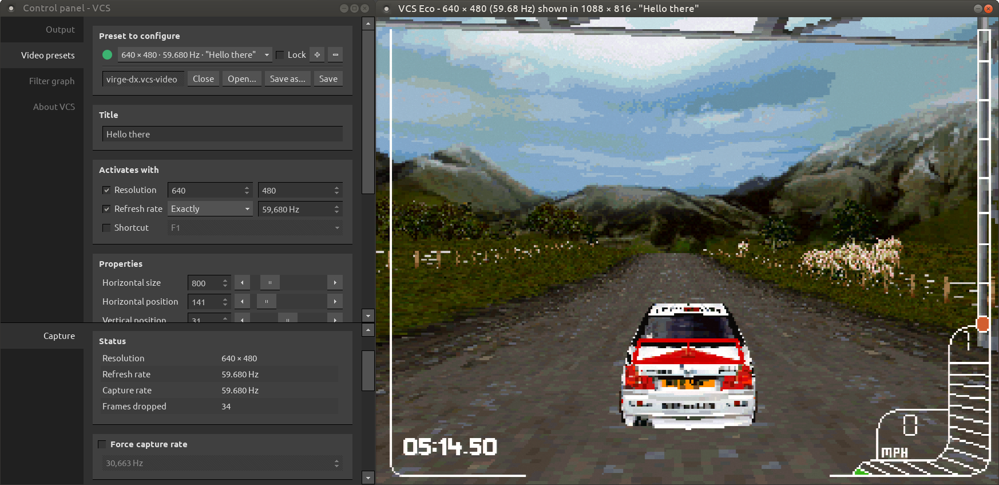
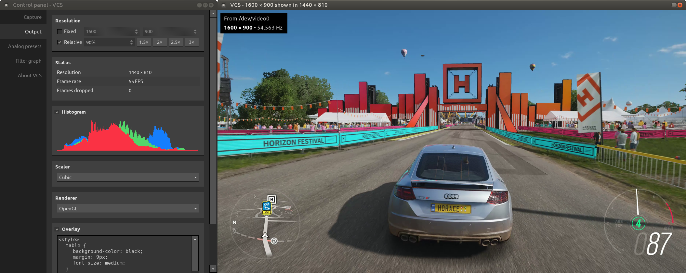
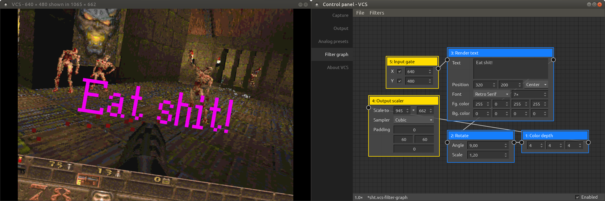

# VCS

A control application for Datapath Vision capture cards on Linux.

## Key features

- Unlimited video presets for analog capture
- Several scaling modes and image filters
- Variable refresh rate output
- Free and open source

## Supported capture hardware

Any model of Datapath capture card supported by the Datapath Vision driver for Linux should be compatible, although the card's full set of capabilities may not be exposed.

## Manuals

- [User's manual](./docs/user/README.md)

## Building

Open [vcs.pro](vcs.pro) in Qt Creator, or run `$ qmake && make -j` in the repo's root. You'll need to meet the [dependencies](#dependencies) and may need to adjust the [build configuration](#build-configuration).

### Dependencies

The VCS codebase depends on the following libraries and frameworks:

- Qt
- OpenCV

I recommend sticking with Qt 5 unless you enjoy fixing a variety of small breakages.

Both OpenCV 4 and OpenCV 3 should be compatible, but no guarantees.

### Build configuration

#### Include paths

The following variables in [vcs.pro](vcs.pro) control where the build system looks for external dependencies:

- `DATAPATH_VISION_HEADER_PATH`
- `OPENCV_HEADER_PATH`
- `OPENCV_LIB_PATH`
- `OPENCV_DEBUG_LIB_PATH` (optional, for debug builds)

You'll likely need to modify at least some of them to point to the correct locations on your system.

#### Release build vs. debug build

VCS can be built in two modes: release or debug. A release build is intended for normal usage, while a debug build includes additional run-time error checks that generally reduce performance but help reveal programming errors.

To enable debug mode, define `VCS_DEBUG_BUILD` in [vcs.pro](vcs.pro). Otherwise, the build will be in release mode. You can confirm whether the program is running in release or debug mode by navigating to Control panel &rarr; About VCS.

In debug mode, you can optionally enable AddressSanitizer and UndefinedBehaviorSanitizer by defining `VCS_DEBUG_BUILD_USES_SANITIZERS` in [vcs.pro](vcs.pro). To suppress Sanitizer warnings in external libraries, create an `asan-suppress.txt` file in the build directory and populate it according to [this guide](https://github.com/google/sanitizers/wiki/AddressSanitizerLeakSanitizer#suppressions).

#### The capture backend

A capture backend is an implementation in VCS providing support for a particular capture source, be it a hardware device (e.g. a Datapath Vision capture card) or something else.

One &ndash; and only one &ndash; capture backend must be active in any build of VCS. To select which, include the corresponding identifier in the `DEFINES` variable in [vcs.pro](vcs.pro).

The following capture backends are available to choose from:

| Backend identifier          | Purpose                                                                                                                       |
| --------------------------- | ----------------------------------------------------------------------------------------------------------------------------- |
| CAPTURE_BACKEND_VISION_V4L  | Supports the Datapath Vision range of capture cards in Linux. Requires installation of the Datapath Vision driver.            |
| CAPTURE_BACKEND_VIRTUAL     | Provides a virtual capture device that generates a test image.                                                                |
| CAPTURE_BACKEND_DOSBOX_MMAP | Captures DOSBox's frame buffer. Requires [patching](./src/capture/dosbox_mmap/dosbox-0.74.3-linux-for-vcs-mmap.patch) DOSBox. |
| CAPTURE_BACKEND_GENERIC_V4L | A sample implementation of a generic, non-Datapath-specific capture backend using Video4Linux. For educational purposes.      |
