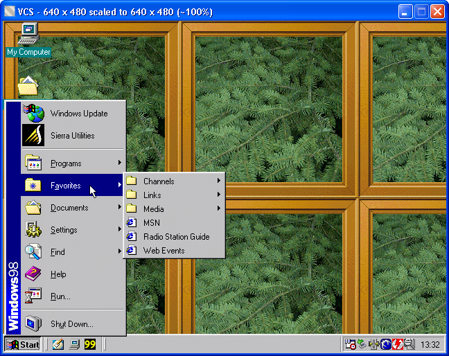
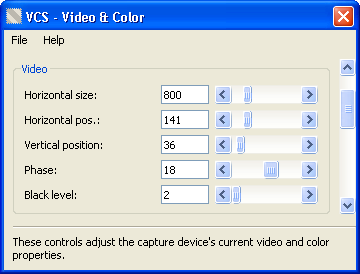
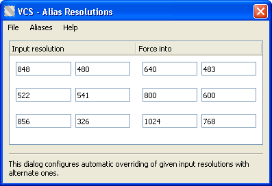
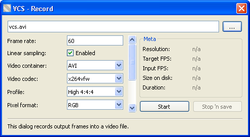
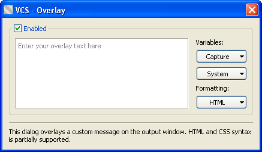
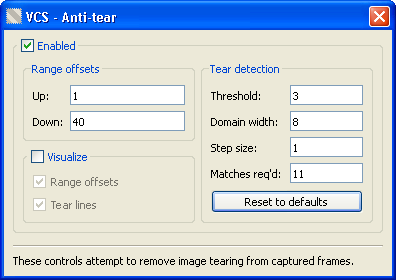
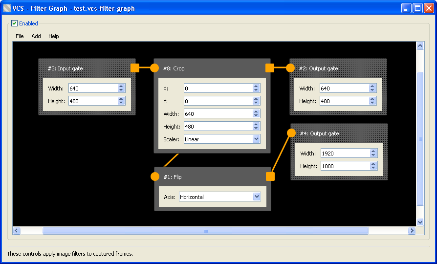

# VCS
A third-party capture tool for Datapath's VisionRGB range of capture cards. Greatly improves the hardware's suitability for capturing dynamic VGA signals (e.g. of retro PCs) compared to Datapath's bundled capture software.

VCS interfaces with compatible capture hardware to display the capture output in a window on your desktop. Additionally, you can apply filters, scalers, anti-tearing, and various other adjustments to the output before it's displayed. A more complete list of VCS's features is given below.

You can find the pre-built binary distribution of VCS for Windows on [Tarpeeksi Hyvae Soft's website](http://tarpeeksihyvaesoft.com/soft/).

### Features
- On-the-fly frame filtering: blur, crop, flip, decimate, rotate, sharpen, ...
- Several frame scalers: nearest, linear, area, cubic, and Lanczos
- Anti-tearing
- Temporal image denoising
- Video recording with H.264 encoding
- Custom overlays with HTML and CSS formatting
- Minimal reliance on GPU features &ndash; ideal for virtual machines
- Unique frame count &ndash; an FPS counter for DOS games!
- Supports Windows XP to Windows 10, and compiles on Linux

### Hardware support
VCS is compatible with at least the following Datapath capture cards:
- VisionRGB-PRO1
- VisionRGB-PRO2
- VisionRGB-E1
- VisionRGB-E2
- VisionRGB-E1S
- VisionRGB-E2S
- VisionRGB-X2

The VisionAV range of cards should also work, albeit without their audio capture functionality.

In general, if you know that your card supports Datapath's RGBEasy API, it should be able to function with VCS.

# User's manual
Contents:
- [Setting up](#setting-up)
- [Output window](#output-window)
    - Interacting with the output window
        - Magnifying glass
        - Dragging
        - Borderless mode
        - Fullscreen mode
        - Resizing
        - Scaling with the mouse wheel
        - Title bar
        - Menu bar
- [Dialogs](#dialogs)
    - Video & color dialog
    - Alias resolutions dialog
    - Record dialog
    - Input resolution dialog
    - Output resolution dialog
    - Anti-tear dialog
    - Filter graph dialog
- [Mouse and keyboard shortcuts](#mouse-and-keyboard-shortcuts)
- [Command-line arguments](#command-line-arguments)

## Setting up
Assuming you've installed the drivers for your capture hardware, as well as unpacked the binary distribution of VCS (linked to, above) into a folder, getting VCS going is simply a matter of running its `vcs.exe` executable.

When you run the executable, two windows will open: a console window, in which notifications about VCS's status will appear during operation; and the [output window](#output-window), in which captured frames are displayed.

- Note: You can launch `vcs.exe` with command-line parameters to automate certain start-up tasks. A list of the command-line options is given in the [command-line](#command-line-arguments) section.

When running VCS for the first time, the first thing you may want to do is adjust the capture video parameters, like phase, color balance, and so on. These can be set up via the [video & color dialog](#video-&-color-dialog).

## Output window
The central point of the VCS user interface is the output window, where captured frames are displayed as they arrive from the capture hardware.

\
*The output window, showing a Windows 98 desktop being captured.*

### Interacting with the output window
#### Magnifying glass
If you press and hold the right mouse button over the output window, the portion of the image under the cursor will be magnified.

- Note: The magnifying glass is not available with the OpenGL renderer.

#### Dragging
You can drag the output window by left-clicking anywhere on the window.

#### Borderless mode
You can double-click inside the output window to toggle its border on/off.

- Note: When the border is toggled off, the window will also snap to the top left corner of the screen.

#### Fullscreen mode
Although you can emulate a fullscreen mode by turning off the output window's border and scaling the window to the size of the the display area, there is also a true fullscreen mode available. You can toggle it with the F11 shortcut key.

For the fullscreen mode to work optimally, you may first need to resize the output window to match the resolution of your screen (see the [output resolution dialog](#output-resolution-dialog)).

#### Resizing
The output window cannot be resized directly. Instead, you can use the [output resolution dialog](#output-resolution-dialog) to adjust the window's size.

#### Scaling with the mouse wheel
By scrolling the mouse wheel over the output window, you can scale the size of the window up and down.

- Note: Mouse wheel scaling is not available while recording video.

This is a shortcut for the `relative scale` setting in the [output resolution dialog](#output-resolution-dialog).

#### Title bar
The output window's title bar displays information about VCS's current state, like the input and output resolutions.

The title bar's text may contain the following elements, in order of appearance from left to right:
- `{!}`: Shown if captured frames are being dropped (e.g. due to VCS lacking sufficient CPU power to keep up with the capture hardware's output rate).
- `VCS`: The program's name!
- `R` `F` `O` `A`: Indicators for whether certain functionality is enabled. Not shown if the corresponding functionality is disabled.
    - `R` &rarr; Recording to video (see [Record dialog](#record-dialog)).
    - `F` &rarr; Filtering enabled (see [Filter graph dialog](#filter-graph-dialog)).
    - `O` &rarr; Overlay enabled (see [Overlay dialog](#overlay-dialog)).
    - `A` &rarr; Anti-tearing enabled (see [Anti-tear dialog](#anti-tear-dialog)).
- `640 x 480`: The current input (capture) resolution.
- `scaled to 704 x 528`: The current output resolution.
- `(~110%)`: An estimate of the percentage by which the input resolution has been scaled for output.

#### Menu bar
The output window contains an auto-hiding menu bar, from which you can access the various controls and dialogs of VCS.

The menu bar will be displayed when you hover the mouse cursor over the output window; and hidden after a few seconds of mouse inactivity.

The menu bar is divided into four categories: `File`, `Input`, `Output`, and `About`. The following is a list of the options available.

##### Menu bar: File
`File` &rarr; `Exit`\
Exit VCS.

##### Menu bar: Input
`Input` &rarr; `Channel`\
Set the hardware capture channel. Depending on the capabilities of your capture hardware, channels #1 through #2 are available.

`Input` &rarr; `Color depth`\
Set the color depth with which frames are captured. This is a hardware-level setting: the capture hardware will convert each frame to this color depth before uploading it to system memory - thus lower color depths consume less bandwidth. Prior to display, VCS will convert the frames to the color depth of the [output window](#output-window).
 
`Input` &rarr; `Video...`\
Open the [video & color](#video-&-color-dialog) dialog.

`Input` &rarr; `Aliases...`\
Open the [alias resolutions](#alias-resolutions-dialog) dialog.

`Input` &rarr; `Resolution...`\
Open the [input resolution](#input-resolution-dialog) dialog.

##### Menu bar: Output
`Output` &rarr; `Renderer`\
Set the type of rendering VCS uses to draw captured frames onto the [output window](#output-window).

- &rarr; `Software`: Most compatible option. Rendering is done on the CPU.
- &rarr; `OpenGL`: Rendering is done on the GPU using OpenGL.

When choosing the renderer, be mindful of the following:
- The OpenGL renderer might not work in Windows XP.
- The output window's magnifying glass feature is not available with the OpenGL renderer.

`Output` &rarr; `Aspect ratio`\
Set the aspect ratio to display captured frames in. Letterboxing will be used to achieve the desired ratio.

- &rarr; `Native`: Display frames in the full size of the [output window](#output-window), without letterboxing.
- &rarr; `Traditional 4:3`: Use 4:3 aspect ratio for resolutions that historically might have been meant to be displayed as such. These include 720 x 400, 640 x 400, and 320 x 200.
- &rarr; `Always 4:3`: Display all frames in 4:3 aspect ratio.

`Output` &rarr; `Upscaler`\
Set the scaler to be used when frames are upscaled to fit the [output window](#output-window).

`Output` &rarr; `Downscaler`\
Set the scaler to be used when frames are downscaled to fit the [output window](#output-window).

`Output` &rarr; `Record...`\
Open the [record](#record-dialog) dialog.

`Output` &rarr; `Overlay...`\
Open the [overlay](#overlay-dialog) dialog.

`Output` &rarr; `Anti-tear...`\
Open the [anti-tear](#anti-tear-dialog) dialog.

`Output` &rarr; `Resolution...`\
Open the [output resolution](#output-resolution-dialog) dialog.

`Output` &rarr; `Filter graph`\
Open the [filter graph](#filter-graph-dialog) dialog.

##### Menu bar: Help
`Help` &rarr; `About...`\
Display information about VCS and the capture hardware.

## Dialogs
The VCS user interface includes a number of dialogs, with which you can adjust the program's operational parameters.

Contents:
- [Video & color dialog](#video-&-color-dialog)
- [Alias resolutions dialog](#alias-resolutions-dialog)
- [Record dialog](#record-dialog)
- [Input resolution dialog](#input-resolution-dialog)
- [Output resolution dialog](#output-resolution-dialog)
- [Anti-tear dialog](#anti-tear-dialog)
- [Filter graph dialog](#filter-graph-dialog)

### Video & color dialog
To access: Ctrl+V or [Menu bar](#menu-bar) &rarr; `Input` &rarr; `Video...`

The video & color dialog lets you to modify the capture hardware's video parameters.

\
*The video & color dialog, showing controls for adjusting the capture hardware's video parameters.*

Any changes you make to the settings will be sent to the capture hardware in real-time, and are reflected accordingly in the [output window](#output-window).

The settings are specific to the current capture resolution, and will be recalled automatically by VCS whenever that capture resolution is used. For instance, if the current resolution is 640 x 480 and you modify a parameter whose default value is 5 to make it 10, VCS will assign this parameter a value of 10 whenever the resolution is 640 x 480, and 5 otherwise. Following that, if the resolution is 800 x 600 and you now set the parameter to 7, the parameter will be assigned a value of 7 whenever the resolution is 800 x 600, 10 whenever the resolution is 640 x 480, and 5 for any other resolution.

- Note: Settings cannot be defined per refresh rate. Thus, the capture modes 640 x 480 @ 60 Hz and 640 x 480 @ 55 Hz both cause VCS to recall the settings for 640 x 480.

If you want your settings to persist after you exit VCS, remember to save them first. This can be done via `File` &rarr; `Save settings as...`.

Saved settings can be restored via `File` &rarr; `Load settings...`.

### Alias resolutions dialog
To access: [Menu bar](#menu-bar) &rarr; `Input` &rarr; `Aliases...`

With the alias resolutions dialog, you can tell VCS to automatically override certain input resolutions.

\
*The alias resolutions dialog, showing controls for creating and managing aliases.*

For instance, if you find that your capture hardware is incorrectly initializing 640 x 400 as 512 x 488 (or something of that sort), you can define 640 x 400 as an alias of 512 x 488. Now, whenever the capture hardware sets the input resolution to 512 x 488, VCS will instruct it to change it to 640 x 400.

### Record dialog
To access: Ctrl+R or [Menu bar](#menu-bar) &rarr; `Output` &rarr; `Record...`

The record dialog gives you the option to stream captured frames into a video file.

\
*The record dialog, showing controls for recording captured frames into a video file.*

The recording functionality will write frames as they appear in the [output window](#output-window) into a video file. But make note of the following:

- Audio will not be recorded.
- The video will be recorded in the H.264 format using an x264 codec.
- The video resolution will be that of the current output size (see the [output resolution dialog](#output-resolution-dialog)).
- The output size cannot be changed while recording; frames will be scaled to fit the current size.
- The [overlay](#overlay-dialog) will not be recorded.

To make use of VCS's recording functionality on Windows, you will need to install the 32-bit version of the [x264vfw](https://sourceforge.net/projects/x264vfw/files/x264vfw/44_2851bm_44825/) codec and run its configurator at least once, so that its settings are added into the Windows registry for VCS to find.

#### Recording settings
**Frame rate.** The video's nominal playback rate. Typically, you will want to match this to the capture source's refresh rate, so that e.g. a 60 Hz capture signal is recorded with a frame rate of 60.

**Linear sampling.** Whether VCS is allowed to duplicate and/or skip frames to match the captured frame rate with the video's nominal playback rate. If linear sampling is disabled, captured frames will be inserted into the video as they are received, and are never duplicated or skipped to maintain time-coherency. Disabling linear sampling may result in smoother-looking playback when the capture frame rate is uneven; but enabling it will help prevent time compression in these cases. If you are planning to append the video with an audio track you recorded at the same time, you will most likely want to enable linear sampling or the video may not keep in sync with the audio.

- Note: While the capture hardware reports 'no signal', no frames will be recorded, regardless of whether linear sampling is enabled.

**Video container.** The file format in which the video is saved. On Windows, the AVI format is used.

**Video codec.** The encoder with which to create the video. On Windows, the 32-bit version of x264vfw is used.

**Additional x264 arguments.** You can provide the encoder with custom command-line parameters via this field.

For best image quality regardless of performance and/or file size, set `profile` to "High 4:4:4", `pixel format` to "RGB", `CRF` to 1, and `preset` to "ultrafast". To maintain high image quality but reduce the file size, you can set `preset` to "veryfast" or "faster", and increase `CRF` to 10&ndash;15. For more tips and tricks, you can look up documentation specific to the x264 encoder.

### Input resolution dialog
To access: Ctrl+I or [Menu bar](#menu-bar) &rarr; `Input` &rarr; `Resolution...`

The input resolution dialog lets you override the capture hardware's current capture resolution.

\
*The input resolution dialog, showing controls for adjusting the capture resolution.*

Normally, the capture hardware will automatically set the capture resolution to match that of the input signal. But sometimes the result is sub-optimal, and you may want to manually override it.

The dialog's buttons will tell the capture hardware to set a particular input resolution regardless of what the hardware thinks is the correct resolution for the input signal.

- Note: The `other...` button lets you specify a custom resolution, in case the pre-set ones are not suitable.

You can change a button's assigned resolution by clicking on it while holding down the Alt key.

### Output resolution dialog
To access: Ctrl+O or [Menu bar](#menu-bar) &rarr; `Output` &rarr; `Resolution...`

The output resolution dialog lets you resize the output window. This also resizes the frames being displayed in the window.

\
*The output resolution dialog, showing controls for adjusting the size of the output window.*

Normally, the size of the [output window](#output-window) will match the capture resolution, but you can use this dialog to scale the window up or down.

- Note: The output resolution controls are not available while recording video (see the [record dialog](#record-dialog)).

#### Settings

**Override.** Lock the size of the output window, so that changes to the capture resolution do not resize it. Frames will be scaled up or down as needed to match this resolution.

**Relative scale.** Scale the size of the output window up or down by a percentage of its base size. The base size is either the capture resolution, or, if enabled, the override resolution.

### Overlay dialog
To access: Ctrl+L or [Menu bar](#menu-bar) &rarr; `Output` &rarr; `Overlay...`

The overlay dialog lets you define a message to be overlaid on the [output window](#output-window).

\
*The overlay dialog, showing controls for overlaying a message on the output window.*

You can combine normal text with pre-set VCS variables and HTML/CSS formatting to create a message to be shown over the output window.

- Note: The overlay will not be included in videos recorded using VCS's built-in recording functionality (see the [record dialog](#record-dialog)).

### Anti-tear dialog
To access: Ctrl+A or [Menu bar](#menu-bar) &rarr; `Output` &rarr; `Anti-tear...`

The anti-tear dialog provides functionality to remove tearing from captured frames.

\
*The anti-tear dialog, showing controls for adjusting the parameters of VCS's anti-tear engine.*

Under some circumstances, such as when the captured source does not sync its rendering with the refresh rate, you may find that the captured frames contain horizontal tearing. VCS comes with an anti-tear engine to help mitigate this problem.

- Note: The anti-tearing is not 100% perfect, in that not absolutely all tears are eliminated. But it should provide a considerable improvement nonetheless.

Anti-tearing can be considered an experimental feature of VCS. It works quite well in many cases, but can fail in others, and may be a performance hog. The default settings should work well enough in most cases, although you will likely need to adjust the range offsets (see below).

#### Settings

**Range offsets.** Set the vertical range inside which the anti-tearing operates. Static content, like a game's UI bar at the top or bottom of the screen, can prevent the anti-tearing from working, and you should set this range so as to exclude such content. You can enable `visualization` to see the range represented with horizontal lines in the [output window](#output-window).

**Visualization.** Draw certain anti-tearing-related markers in the output window.

**Threshold.** Set the maximum amount by which pixel color values are allowed to change between two frames without being considered new data. The less noise there is in the capture, the lower you can set this value.

**Domain width.** Set the size of the sampling window. A lower value reduces CPU usage, but may be less able to detect subtle tearing.

**Step size.** Set the number of pixels by which to slide the sampling window at a time. A higher value reduces CPU usage, but may be less able to detect tearing.

**Matches req'd.** Set how many times on a row of pixels the sums of the sampling window need to exceed the threshold for that row of pixels to be considered new data.

### Filter graph dialog
To access: Ctrl+F or [Menu bar](#menu-bar) &rarr; `Output` &rarr; `Filter graph...`

The filter graph dialog allows you to create chains of image filters to be applied to captured frames prior to display in the [output window](#output-window).

\
*The filter graph dialog, showing controls for creating and modifying filter chains.*

The filter graph is made up of nodes that can be connected together in a chain. These nodes come in three varieties: `input gate`, `output gate`, and `filter`.

The input and output gates determine the resolutions for which the connected filters will be applied. For instance, if you set an input gate's width and height to 640 and 480, and the width and height of an output gate to 1920 and 1080, any filters you connect between these two nodes will be applied when the size of the output window is 1920 x 1080 and the original resolution of the frames (i.e. the capture resolution) is 640 x 480. You can also use the value 0 for a gate's width and/or height to allow VCS to match any value to that dimension: an input gate with a width and height of 0, for instance, will apply the connected filters to frames of all capture resolutions, provided that they also meet the resolution specified for the output gate. A filter graph can have multiple chains of these input-filter-output combos, and VCS will select the most suitable one (or none) given the current capture and output resolutions.

- Note: When deciding which of multiple filter chains to use, VCS will prefer more specific chains to more general ones. If you have e.g. an input gate whose width and height are 0, and another input gate whose width and height are 640 and 480, the latter will be used when the capture resolution is exactly 640 x 480, and the former otherwise. Likewise, if your input gates are 0 x 0 and 640 x 0, the former will be applied for capture resolutions of *any* x *any*, except for 640 x *any*, where the latter chain will apply - except if you also have a third input gate of 640 x 480, in which case that will be used when the capture resolution is exactly 640 x 480.

To connect two nodes, click and drag with the left mouse button from one node's output edge (square) to another's input edge (circle), or vice versa. A node can be connected to as many other nodes as you like. To disconnect a node from another, right-click on the node's output edge, and select the other node from the list that pops up. To remove a node itself from the graph, right-click on the node and select to remove it. To add nodes to the graph, select `Add` from the dialog's menu bar.

## Mouse and keyboard shortcuts
You can make use of the following mouse and keyboard shortcuts:
```
Double-click
VCS's output window ..... Toggle window border on/off.

Middle-click
output window ........... Open the overlay editor.

Left-press and drag
output window ........... Move the window (same as dragging by its title bar).

Right-press
output window ........... Magnify this portion of the output window.

Mouse wheel
output window ........... Scale the output window up/down.

F5 ...................... Snap the capture display to the edges of the frame.

F11 ..................... Toggle fullscreen mode on/off.

Ctrl + A ................ Open the anti-tear dialog.

Ctrl + F ................ Open the filter graph dialog.

Ctrl + V ................ Open the video settings dialog.

Ctrl + I ................ Open the input resolution dialog.

Ctrl + O ................ Open the output resolution dialog.

Ctrl + R ................ Open the record dialog.

Ctrl + L ................ Open the overlay dialog.

Ctrl + Shift + key ...... Toggle the corresponding dialog's functionality on/off.

Ctrl + 1 to 9 ........... Shortcuts for the input resolution buttons on the
                          control panel's Input tab.

Alt + Shift + Arrows .... Adjust the capture's video position horizontally
                          and vertically.
```

## Command-line arguments
Optionally, you can pass one or more of following command-line arguments to VCS:
```
-m <path + filename> .... Load capture parameters from the given file on start-
                          up. Capture parameter files typically have the .vcsm
                          or .vcs-video suffix.

-f <path + filename> .... Load a custom filter graph from the given file on
                          start- up. Filter graph files typically have the .vcs-
                          filter-graph suffix.

-a <path + filename> .... Load alias resolutions from the given file on start-
                          up. Alias resolution files typically have the .vcsa
                          suffix.

-i <input channel> ...... Start capture on the given input channel (1...n). By
                          default, channel #1 will be used.
```

For instance, if you had capture parameters stored in the file `params.vcsm`, and you wanted capture to start on input channel #2 when you run VCS, you might launch VCS like so:
```
vcs.exe -m "params.vcsm" -i 2
```

# Building
**On Linux:** Do `qmake && make` at the repo's root, or open [vcs.pro](vcs.pro) in Qt Creator. **Note:** By default, VCS's capture functionality is disabled on Linux, unless you edit [vcs.pro](vcs.pro) to remove `DEFINES -= USE_RGBEASY_API` from the Linux-specific build options. I don't have a Linux-compatible capture card, so I'm not able to test capturing with VCS natively in Linux, which is why this functionality is disabled by default.

**On Windows:** The build process should be much the same as described for Linux, above; except that capture functionality will be enabled, by default.

While developing VCS, I've been compiling it with GCC 5.4 on Linux and MinGW 5.3 on Windows, and my Qt has been version 5.5 on Linux and 5.7 on Windows. If you're building VCS, sticking with these tools should guarantee the least number of compatibility issues.

### Dependencies
**Qt.** VCS uses [Qt](https://www.qt.io/) for its GUI and certain other functionality. Qt of version 5.5 or newer should satisfy VCS's requirements. The binary distribution of VCS for Windows includes the required DLLs.
- Non-GUI code interacts with the GUI through a wrapper interface ([src/display/display.h](src/display/display.h), instantiated for Qt in [src/display/qt/d_main.cpp](src/display/qt/d_main.cpp)). If you wanted to implement the GUI with something other than Qt, you could do so by creating a new wrapper that implements this interface.
    - There is, however, currently some bleeding of Qt functionality into non-GUI regions of the codebase, which you would need to deal with also if you wanted to fully excise Qt. Namely, in the units [src/record/record.cpp](src/record/record.cpp), [src/common/disk.cpp](src/common/disk.cpp), and [src/common/csv.h](src/common/csv.h).

**OpenCV.** VCS makes use of the [OpenCV](https://opencv.org/) 3.2.0 library for image filtering and scaling, and for video recording. The binary distribution of VCS for Windows includes a pre-compiled DLL of OpenCV 3.2.0 compatible with MinGW 5.3.
- The dependency on OpenCV can be broken by undefining `USE_OPENCV` in [vcs.pro](vcs.pro). If undefined, most forms of image filtering and scaling will be unavailable, and video recording will not be possible.

**RGBEasy.** VCS uses Datapath's RGBEasy API to interface with the capture hardware. The drivers for your Datapath capture card should include and have installed the required libraries.
- The dependency on RGBEasy can be broken by undefining `USE_RGBEASY_API` in [vcs.pro](vcs.pro). If undefined, VCS will not attempt to interact with the capture hardware in any way.

# Code organization
**Modules.** The following table lists the four main modules of VCS:

| Module  | Source                             | Responsibility                        |
| ------- | ---------------------------------- | ------------------------------------- |
| Capture | [src/capture/](src/capture/)       | Interaction with the capture hardware |
| Scaler  | [src/scaler/](src/scaler/)         | Frame scaling                         |
| Filter  | [src/filter/](src/filter/)         | Frame filtering                       |
| Record  | [src/record/](src/record/)         | Record capture output into video      |
| Display | [src/display/qt/](src/display/qt/) | Graphical user interface              |

**Main loop and program flow.** VCS has been written in a procedural style. As such, you can easily identify &ndash; and follow &ndash; the program's main loop, which is located in `main()` in [src/main.cpp](src/main.cpp).

- The main loop first asks the `Capture` module to poll for any new capture events, like a new captured frame.
- Once a new frame has been received, it is directed into the `Filter` module for any pre-scaling filtering.
- The filtered frame will then be passed to the `Scaler` module, where it's scaled to match the user-specified output size.
- The scaled frame will be fed into the `Filter` module again for any post-scaling filtering.
- Finally, the frame is sent to the `Display` module for displaying on screen.

**Qt's event loop.** The loop in which Qt processes GUI-related events is spun manually (by `update_gui_state()` in [src/display/qt/windows/output_window.cpp](src/display/qt/windows/output_window.cpp)) each time a new frame has been received from the capture hardware. This is done to match the rate of screen updates on the output to that of the input capture source.

## How-to

### Adding a frame filter

Frame filters allow captured frames' pixel data to be modified before being displayed on-screen. A filter might, for instance, blur, crop, and/or rotate the frames.

In-code, a filter consists of a `function` and a `widget`. The filter function applies the filter to a given frame's pixel data; and the filter widget is a GUI element that lets the user modify the filter's parameters &ndash; like the radius of a blur filter.

Adding a new filter to VCS is fairly straightforward; the process is described below.

#### Defining the filter function
The filter function is to be defined in [src/filter/filter.cpp](src/filter/filter.cpp) and its header. Looking at that source file, you can see the following pattern:
```
// Pre-declare the filter function.
static void filter_func_NAME(...);

// Make VCS aware of the filter's existence.
static const std::unordered_map ... KNOWN_FILTER_TYPES =
{
    ...
    {"UUID", {"NAME", filter_type_enum_e::ENUMERATOR, FUNCTION}},
    ...
};

// Define the filter function.
static void filter_func_NAME(FILTER_FUNC_PARAMS)
{
    VALIDATE_FILTER_INPUT

    // Perform the filtering.
    ...
}

// Tie the filter function to its filter widget.
filter_widget_s *filter_c::create_gui_widget(...)
{
    ...
    switch (this->metaData.type)
    {
        case filter_type_enum_e::ENUMERATOR: return new filter_widget_NAME_s(...);
    }
    ...
}
```

And in the header file:
```
// Enumerate the filter.
enum class filter_type_enum_e
{
    ...
    ENUMERATOR,
    ...
};
```

The filter function's parameter list macro `FILTER_FUNC_PARAMS` expands to
```
u8 *const pixels, const resolution_s *const r, const u8 *const params
```
where `pixels` is a one-dimensional array of 32-bit color values (8 bits each for BGRA), `params` is an array providing the filter's parameter values, and `r` is the frame's resolution, giving the size of the `pixels` array.

The following simple sample filter function uses OpenCV to set each pixel in the frame to a light blue color. (Note that you should encase any code that uses OpenCV in a `#if USE_OPENCV` block.)
```
static void filter_func_blue(FILTER_FUNC_PARAMS)
{
    VALIDATE_FILTER_INPUT

    #if USE_OPENCV
        cv::Mat output = cv::Mat(r->h, r->w, CV_8UC4, pixels);
        output = cv::Scalar(255, 150, 0, 255);
    #endif
}
```

You can peruse the existing filter functions in [src/filter/filter.cpp](src/filter/filter.cpp) to get a feel for how the filter function can be operated.

#### Filter widget
The filter widget is to be defined in [src/display/qt/widgets/filter_widgets.cpp](src/display/qt/widgets/filter_widgets.cpp) and the associated header. Each widget is defined as a struct subclassing `filter_widget_s`.

The following is a minimal widget example for a filter with one user-adjustable parameter (radius).

```
struct filter_widget_NAME_s : public filter_widget_s
{
    enum data_offset_e { OFFS_RADIUS = 0 };

    filter_widget_NAME_s(u8 *const parameterArray, const u8 *const initialParameterValues) :
        filter_widget_s(filter_type_enum_e::ENUMERATOR, parameterArray, initialParameterValues)
    {
        if (!initialParameterValues) this->reset_parameter_data();
        create_widget();
        return;
    }

    void reset_parameter_data(void) override
    {
        k_assert(this->parameterArray, "Expected non-null pointer to filter data.");

        memset(this->parameterArray, 0, sizeof(u8) * FILTER_PARAMETER_ARRAY_LENGTH);

        // Set the parameter's default value.
        this->parameterArray[OFFS_RADIUS] = 5;

        return;
    }

private:
    Q_OBJECT
    
    void create_widget(void) override
    {
        // Create a frame that will group together the widget's contents.
        QFrame *frame = new QFrame();
        frame->setMinimumWidth(this->minWidth);

        // Create a set of UI controls for the user to adjust the filter's parameter.
        QLabel *label = new QLabel("Radius:", frame);
        QSpinBox *spin = new QSpinBox(frame);
        radiusSpin->setRange(0, 99);
        radiusSpin->setValue(this->parameterArray[OFFS_RADIUS]);

        QFormLayout *l = new QFormLayout(frame);
        l->addRow(label, spin);

        // Make the parameter's value change as the user operates the associated UI controls.
        connect(spin, static_cast<void (QSpinBox::*)(int)>(&QSpinBox::valueChanged), [this](const int newValue)
        {
            k_assert(this->parameterArray, "Expected non-null filter data.");
            this->parameterArray[OFFS_RADIUS] = newValue;
        });

        frame->adjustSize();
        this->widget = frame;

        return;
    }
};
```

You can look around [src/display/qt/widgets/filter_widgets.h](src/display/qt/widgets/filter_widgets.h) and the associated source file for concrete examples of VCS's filter widgets.

# Project status
VCS is currently in post-1.0, having come out of beta in 2018. Development is sporadic.

### System requirements
You are encouraged to have a fast CPU, since most of VCS's operations are performed on the CPU. The GPU is of less importance, and even fairly old ones will likely work. VCS uses roughly 1 GB of RAM, and so your system should have at least that much free &ndash; preferably twice as much or more.

**Performance.** On my Intel Xeon E3-1230 v3, VCS performs more than adequately. The table below shows that an input of 640 x 480 can be scaled to 1920 x 1440 at about 300&ndash;400 frames per second, depending on the interpolation used.

| 640 x 480    | Nearest | Linear | Area | Cubic | Lanczos |
|:------------ |:-------:|:------:|:----:|:-----:|:-------:|
| 2x upscaled  | 1100    | 480    | 480  | 280   | 100     |
| 3x upscaled  | 460     | 340    | 340  | 180   | 50      |

Drawing frames onto the [output window](#output-window) using software rendering is likewise sufficiently fast, as shown in the following table. An input of 640 x 480 can be upscaled by 2x and drawn on screen at roughly 340 frames per second when using nearest-neighbor interpolation.

| 640 x 480       | 1x<br>Nearest | 2x<br>Nearest | 3x<br>Nearest |
|:--------------- |:-------------:|:-------------:|:-------------:|
| With display    | 1360          | 340           | 150           |
| Without display | 1910          | 1100          | 510           |

Padding (i.e. aspect ratio correction) can incur a performance penalty with some of the scalers. The following table shows the frame rates associated with scaling a 640 x 480 input into 1920 x 1080 with and without padding to 4:3.

| 480p to 1080p | Nearest | Linear | Area | Cubic | Lanczos |
|:------------- |:-------:|:------:|:----:|:-----:|:-------:|
| Padded / 4:3  | 390     | 270    | 270  | 200   | 80      |
| No padding    | 820     | 370    | 370  | 210   | 70      |

# Authors and credits
The primary author of VCS is the one-man Tarpeeksi Hyvae Soft (see on [GitHub](https://github.com/leikareipa) and the [Web](http://www.tarpeeksihyvaesoft.com)).

VCS uses [Qt](https://www.qt.io/) for its UI, [OpenCV](https://opencv.org/) for image filtering, and [Datapath](https://www.datapath.co.uk/)'s RGBEasy API for interfacing with the capture hardware.
