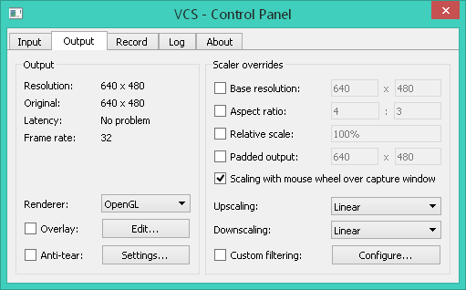

# VCS
A third-party capture tool for Datapath's VisionRGB range of capture cards. Greatly improves the hardware's suitability for dynamic VGA capture (e.g. of retro PCs) compared to Datapath's own capture software. Is free and open-source.

VCS interfaces with compatible capture hardware to display the capture output in a window on your desktop. Additionally, you can apply filters, scalers, anti-tearing, and various other adjustments to the output before it's displayed. A more complete list of VCS's features is given, below.

You can find a binary distribution of VCS on [Tarpeeksi Hyvae Soft's website](http://tarpeeksihyvaesoft.com/soft/).

### Features
- Anti-tearing to reduce screen-tearing in analog capture
- On-the-fly filtering: blur, crop, flip, decimate, rotate, sharpen...
- Multiple scalers: nearest, linear, area, cubic, and Lanczos
- Per-resolution capture and display settings
- Temporal image denoising to remove analog capture noise
- Padded output to maintain a constant output resolution
- Custom overlays with HTML formatting
- Count of unique frames per second &ndash; an FPS counter for DOS games!
- Optimized for virtual machines by minimizing reliance on GPU features
- Works on Windows XP to Windows 10 and compiles for Linux

### Hardware support
VCS is compatible with at least the following Datapath capture cards:
- VisionRGB-PRO1
- VisionRGB-PRO2
- VisionRGB-E1
- VisionRGB-E2
- VisionRGB-E1S
- VisionRGB-E2S
- VisionRGB-X2

The VisionAV range of cards should also work, albeit without their audio capture functionality.

In general, if you know that your card supports Datapath's RGBEasy API, it should be able to function with VCS.

# How to use VCS
_Coming_

## Setting up
Assuming you've installed the drivers for your capture hardware, and unpacked the binary distribution of VCS (linked to, above) into a folder, getting VCS going is simply a matter of running its `vcs.exe` executable.

When you run the executable, three windows open: a console window, in which notifications about VCS's status will apear during operation; the [output window](#the-output-window), in which captured frames will be displayed; and the [control panel](#the-control-panel), from which you can control aspects of VCS's operation.

- Note: You can launch `vcs.exe` with certain command-line parameters to automate tasks like loading up settings files. A list of the available command-line parameters is given in the [Command-line](#command-line) subsection.

One of the first things you'll probably want to do after getting VCS up and running is to adjust the video parameters, like phase, image positioning, color balance, and so on, to get the output from the capture hardware to look as it should. You can get all that done through VCS, and the sections below will tell you how. (If you're in a hurry, you can [jump straight to the part that shows you where to adjust the video settings](#input-tab).)

## The output window
The central feature of VCS is the output window, where the captured frame data is displayed in real-time as it arrives from the capture hardware.

The output window has been kept free of unnecessary clutter &ndash; there are no visible controls, only a couple of bits of convenient information in the window's title bar. This allows you to concentrate fully on the capture output.


### Hidden functionality

To tell you a secret, there _is_ some hidden functionality to the output window, despite it having no visible controls per se.

#### Magnifying glass
If you press and hold the right mouse button over the output window, a portion of the output image under the cursor will be magnified.

The magnifying glass can be useful if, for instance, you're adjusting the capture's video parameters, like phase, and want to inspect the output for any smaller artefacts remaining.


#### Borderless mode
You can double-click inside the output window to toggle the window's border on and off. This is useful if you want a 'full-screen' experience, or if for some other reason you don't like seeing the window border.

When the border is toggled off, the window is automatically snapped to the top left corner of the screen.

While borderless, you can drag the window by grabbing anywhere on it with the left mouse button.


#### Scaling with the mouse wheel
You can hover the cursor over the output window and scroll the mouse wheel up or down to scale the window's size.

#### Quick access to the overlay editor
You can click inside the capture window with the middle mouse button to open the overlay editor.

## The control panel
The control panel is the heart of VCS. With it, you can control the various aspects of how the capture hardware conducts its operation, how VCS displays the captured frames, and so on.

The controls and information in the control panel are divided thematically into four tabs: `Input`, `Output`, `Log`, and `About`. Below, you'll find descriptions of each tab and the functionality they provide.

### Input tab


The `Input` tab lets you view and control the parameters related to the capture hardware's current input channel.

If your capture hardware has multiple input channels, you can switch between them using the drop-down selector at the top of the `Input` tab. (The screenshot was taken with capture disabled, so the selector is showing no text; but normally you'd see it displaying "Channel #1" or the like.)

**Signal.** The type of input signal currently being received by the capture hardware.

**Video mode.** The resolution and refresh rate of the input signal currently being received by the capture hardware.

**Frame skip.** Skip every *n*th frame. This is a hardware-level setting: the skipping is done by the capture card, and the intermediate frames are never uploaded to the system or received by VCS.

**Color depth.** Set the color depth with which the captured frames are displayed. This is a hardware-level setting: the capture card will convert each frame to this color depth before uploading it to the system; so lower color depths consume less system bandwidth. VCS will convert the frames back to the full color depth of its output window for display, although any fidelity lost in a previous conversion will remain.

**Alias resolutions.** Define alias resolutions. An alias resolution is a resolution that you want to force the capture hardware into when it proposes another resolution. For instance, if you know that the capture source's resolution is 512 x 384, but the capture hardware detects it as 511 x 304, you can assign 511 x 304 as an alias of 512 x 384. After that, every time the capture hardware sets its input resolution to 511 x 304, VCS will tell it to use 512 x 384, instead.

**Adjust video & color.** Adjust various capture parameters, like color balance, phase, horizontal position, etc. The settings are specific to the current input resolution, and will be recalled automatically by VCS each time this resolution is entered. If you have defined no settings for the current input resolution, VCS will use its default ones. Remember to save any custom settings before you exit VCS, if you want to keep them. The settings are hardware-level and will be enforced by the capture hardware.

**Force input resolution.** Tell the capture hardware to adopt a particular input resolution. If the capture source's resolution doesn't match the capture hardware's input resolution, the captured frames will likely not display correctly in VCS. If you click on a button while holding down the control key, you can change the resolution assigned to that button. The `Other...` button lets you specify an arbitrary resolution.

### Output tab


The `Output` tab lets you view and control the parameters related to VCS's output of captured frames.

**Resolution.** The current output resolution. This will be the size of the output window.

**Original.** The current input resolution.

**Latency.** If the capture card sends VCS a new frame before VCS has finished processing the previous one, the new frame will be ignored, and this will display "Dropping frames". Otherwise, all frames sent by the capture card are being processed and displayed by VCS in a timely manner, and this shows "No problem".

**Frame rate.** The number of frames passing through the capture pipeline 
per second. The pipeline consists of the following stages: a frame being received by VCS from the capture card, the frame being scaled and filtered, and the frame being drawn on VCS's output window.

**Renderer.** Set the type of rendering VCS uses to draw captured frames onto the [output window](#the-output-window). The _software_ renderer should be the most compatible option. The _OpenGL_ renderer may offer e.g. compatibility with adaptive synchronization technologies.
- The _OpenGL_ renderer may not work in Windows XP.
- The [magnifying glass](#magnifying-glass) feature is not available when using the _OpenGL_ renderer.
- Padded output (see below) is not available when using the _OpenGL_ renderer.
- The overlay (see below) is not available when using the _OpenGL_ renderer.

**Overlay.** Create a message to be overlaid on VCS's output window during capture. You can enter custom text, choose from several variables that update in real-time, and style the message with HTML. The overlay will only be shown while a signal is being received from the capture hardware.


**Anti-tear.** Enable automatic removal of image tears from captured frames. Tearing can result, for instance, when the capture source is displaying a non-v-synced application: capturing DOS games often results in torn frames, as does capturing games in general whose FPS is less than or more than the refresh rate. The anti-tearing will not work in all cases &ndash; for instance, when the capture source's application is redrawing its screen at a rate higher than the refresh rate, e.g. at more than 60 FPS. You can find more information about anti-tearing in the [Anti-tearing](#anti-tearing) subsection.


**Base resolution.** Set a custom output resolution, i.e. the resolution to which all input frames will be scaled prior to display.

**Aspect ratio.** Set a custom aspect ratio for the output frames.

**Relative scale.** Scale the output frames as a percentage of the input resolution.

**Padded output.** Pad the output frames to the given resolution. Padding is performed after all other forms of scaling (described above). Padding will never scale the frame itself: for instance, if the input frame is 640 x 480, and you pad it to 1280 x 960, the output will be a 1280 x 960 image with black bars around the perimeter and the original 640 x 480 frame in the middle.
- Padded output is not available when using the OpenGL renderer.

**Upscaler.** Set the type of scaling to be used when the output resolution is larger than the input resolution. Any relevant custom filtering (see below) will override this setting.

**Downscaler.** Set the type of scaling to be used when the output resolution is smaller than the input resolution. Any relevant custom filtering (see below) will override this setting.

**Custom filtering.** Create sets of image filters to be applied to incoming frames. You can find more information about custom filtering in the [Custom filters](#custom-filters) subsection.

### Log tab


The `Log` tab displays the various internal mssages generated by VCS during its operation.

You can selectively show or hide messages based on their category: _info_ messages are general notifications of events; _debug_ messages contain information that's non-essential to the user but of possible interest to the developer; and _N.B._ (nota bene) messages are errors, warnings, and other such messages of importance. You can also disable logging altogether.

The messages shown in the `Log` tab are also displayed in VCS's console window.

### About tab
The `About` tab provides information about VCS, like its current version. It also shows information about the capture hardware it's currently interfaced with.

## Custom filters
_Coming_

## Alias resolutions
_Coming_

## Anti-tearing
Under some circumstances, like when capturing DOS games, you may find that the captured frames contain tearing artefacts. This is most likely caused by the capture hardware having sampled an incompletely drawn frame from the source signal &ndash; for instance, due to the source not syncing its rendering to its refresh rate. A tear, then, results as the visible edge between the incompletely drawn new frame, and the still partially visible previous frame.

VCS comes with some facilities for reducing tearing artefacts. You can enable anti-tearing from the control panel's `Output` tab, by marking the `Anti-tear` check-box.


Anti-tearing in VCS works by accumulating the incoming frame data from the capture hardware into an off-screen frame buffer, and displaying the buffer's contents in the output window only once all of the frame's data has been accumulated.

Noise inherent in analog capture causes some uncertainty, however, about which parts of an incoming frame are the new data to be accumulated, and which parts differ from the previous frame only due to irrelevant noise.

The accuracy with which the anti-tearing system can tell apart noise from legit changes between frames has a strong impact on the extent to which the system can remove tears. Currently, the system attempts this by sliding a horizontal sampling window along two adjacent frames' pixels, and comparing the sums of the pixel values within that window. If the sums differ by more than a given threshold, the entire row of pixels is condered new and accumulated into the frame buffer.

You can view and adjust the relevant parameters of this operation by clicking the `Settings...` button next to the `Anti-tear` check-box on the control panel's `Output` tab. Depending on what you're capturing, you may find that the default values work well enough; but in other cases, you may have better results by trying different values.


**Range offsets.** Set the vertical range inside which the anti-tearing accumulates frame data. Static content, like a game's UI bars at the top or bottom of the screen, can completely throw off the system, and need to be excluded from consideration. The anti-tearing will ignore the first _up_ pixel rows and the last _down_ pixel rows in each frame. You can enable `Visualization` to see the values of _up_ and _down_ as corresponding vertical lines in the output window, allowing you to more easily align them with the content.

**Visualization.** Draw certain anti-tearing-related markers in the output window.

**Threshold.** Set the maximum amount by which pixel color values are allowed to change between two frames without being considered new data. The less noise there is in the capture, the lower you can set this value; and vice versa.

**Domain width.** Set the size of the sampling window. A lower value reduces CPU usage, but may be less able to detect subtle tearing.

**Step size.** Set the number of pixels by which to slide the sampling window at a time. A higher value reduces CPU usage, but may be less able to detect tearing.

**Matches req'd.** Set how many times on a row of pixels the sums of the sampling window need to exceed the threshold for that row of pixels to be considered new data.

**Update direction.** _n/a_

In general, anti-tearing is an experimental feature in VCS. It works quite well in many cases, but can fail in others, and may be a performance hog unless you have a fast CPU.

## Mouse and keyboard shortcuts
You can make use of the following mouse and keyboard shortcuts:
```
Double-click
VCS's output window ..... Toggle window border on/off.

Middle-click
output window ........... Open the overlay editor.

Left-press and drag
output window ........... Move the window (same as dragging by its title bar).

Right-press
output window ........... Magnify this portion of the output window.

Mouse wheel
output window ........... Scale the output window up/down.

F1 ...................... Force the capture's input resolution to 640 x 400.

F2 ...................... Force the capture's input resolution to 720 x 400.

Ctrl+A .................. Open the anti-tear dialog.

Ctrl+F .................. Open the filter sets dialog.

Ctrl+V .................. Open the video settings dialog.
```

Additionally, the following keyboard shortcuts are available since VCS 1.3.1:
```
F11 ..................... Toggle full-screen mode on/off.
```

## Command-line
Optionally, you can pass one or more of following command-line arguments to VCS:
```
-m <path + filename> .... Load capture parameters from the given file on start-
                          up. Capture parameter files typically have the .vcsm
                          suffix.

-f <path + filename> .... Load custom filter sets from the given file on start-
                          up. Filter set files typically have the .vcsf suffix.

-a <path + filename> .... Load alias resolutions from the given file on start-
                          up. Alias resolution files typically have the .vcsa
                          suffix.

-i <input channel> ...... Start capture on the given input channel (1...n). By
                          default, channel #1 will be used.
```

For instance, if you had capture parameters stored in the file `params.vcsm`, and you wanted capture to start on input channel #2 when you run VCS, you might launch VCS like so:
```
vcs.exe -m "params.vcsm" -i 2
```

# Building
**On Linux:** Do `qmake && make` at the repo's root, or open [vcs.pro](vcs.pro) in Qt Creator. **Note:** By default, VCS's capture functionality is disabled on Linux, unless you edit [vcs.pro](vcs.pro) to remove `DEFINES -= USE_RGBEASY_API` from the Linux-specific build options. I don't have a Linux-compatible capture card, so I'm not able to test capturing with VCS natively in Linux, which is why this functionality is disabled by default.

**On Windows:** The build process should be much the same as described for Linux, above; except that capture functionality will be enabled, by default.

While developing VCS, I've been compiling it with GCC 5.4 on Linux and MinGW 5.3 on Windows, and my Qt has been version 5.5 on Linux and 5.7 on Windows. If you're building VCS, sticking with these tools should guarantee the least number of compatibility issues.

### Dependencies
**Qt.** VCS uses [Qt](https://www.qt.io/) for its GUI and certain other functionality. Qt of version 5.5 or newer should satisfy VCS's requirements. The binary distribution of VCS for Windows includes the required DLLs.
- Non-GUI code in VCS interacts with the Qt GUI through a wrapper ([src/display/qt/d_main.cpp](src/display/qt/d_main.cpp)). In theory, if you wanted to use a GUI framework other than Qt, you could do so by editing the wrapper, and implementing responses to its functions in your other framework. However, there is also some Qt bleed into non-GUI areas, e.g. as use of the QString class across much of the codebase.

**OpenCV.** VCS makes use of the [OpenCV](https://opencv.org/) 3.2.0 library for image filtering and scaling, and for video recording. The binary distribution of VCS for Windows includes a pre-compiled DLL of OpenCV 3.2.0 compatible with MinGW 5.3.
- The dependency on OpenCV can be broken by undefining `USE_OPENCV` in [vcs.pro](vcs.pro). If undefined, most forms of image filtering and scaling will be unavailable, and video recording will not be possible.

**RGBEasy.** VCS uses Datapath's RGBEasy API to interface with the capture hardware. The drivers for your Datapath capture card should include and have installed the required libraries.
- The dependency on RGBEasy can be broken by undefining `USE_RGBEASY_API` in [vcs.pro](vcs.pro). If undefined, VCS will not attempt to interact with the capture hardware in any way.

# Code organization
**Modules.** The following table lists the four main modules of VCS:

| Module  | Source                             | Responsibility                        |
| ------- | ---------------------------------- | ------------------------------------- |
| Capture | [src/capture/](src/capture/)       | Interaction with the capture hardware |
| Scaler  | [src/scaler/](src/scaler/)         | Frame scaling                         |
| Filter  | [src/filter/](src/filter/)         | Frame filtering                       |
| Display | [src/display/qt/](src/display/qt/) | Graphical user interface              |

**Main loop and program flow.** VCS has been written in a procedural style. As such, you can easily identify &ndash; and follow &ndash; the program's main loop, which is located in `main()` in [src/main.cpp](src/main.cpp).

- The main loop first asks the `Capture` module to poll for any new capture events, like a new captured frame.
- Once a new frame has been received, it is directed into the `Filter` module for any pre-scaling filtering.
- The filtered frame will then be passed to the `Scaler` module, where it's scaled to match the user-specified output size.
- The scaled frame will be fed into the `Filter` module again for any post-scaling filtering.
- Finally, the frame is sent to the `Display` module for displaying on screen.

**Qt's event loop.** The loop in which Qt processes GUI-related events is spun manually (by `update_gui_state()` in [src/display/qt/d_window.cpp](src/display/qt/d_window.cpp)) each time a new frame has been received from the capture hardware. This is done to match the rate of screen updates on the output to that of the input capture source.

In theory, spinning the Qt event loop by hand could create some issues. On the one hand, I've not yet seen any; but on the other hand, I use VCS through a virtual machine, and may simply be oblivious to issues that arise when run natively but not via a VM. If you do encounter issues like screen tearing or laggy GUI operation, and know that they're not present in the captured frames themselves, you may want to look into alternate ways to spin Qt's event loop. One way is to draw the frames onto a QOpenGLWidget surface you've set to block for v-sync.

# Project status
VCS is currently in post-1.0, having come out of beta in 2018. Development is sporadic.

### System requirements
You are encouraged to have a fast CPU, since most of VCS's operations are performed on the CPU. The GPU is of less importance, and even fairly old ones will likely work. At least 2 GB of RAM is required, but at least 4 GB is recommended.

### A word about VCS's GUI
I run my capture card, the VisionRGB-PRO2, through a virtual machine, since the Linux I'm on isn't natively supported by the card. In the VM, performance-wise, I find that a Windows XP guest works best, so I use that.

For that reason, the VCS GUI has been tweaked for use with Windows XP, and looks somewhat old-fashioned and disjoint on newer versions of Windows. I'm aware of this, but unfortunately it can't be helped in the current circumstance, since I want to be able to run VCS properly in my own use.

# Authors and credits
The primary author of VCS is the one-man Tarpeeksi Hyvae Soft (see on [GitHub](https://github.com/leikareipa) and the [Web](http://www.tarpeeksihyvaesoft.com)).

VCS uses [Qt](https://www.qt.io/) for its UI, [OpenCV](https://opencv.org/) for image filtering, and [Datapath](https://www.datapath.co.uk/)'s RGBEasy API for interfacing with the capture hardware.
