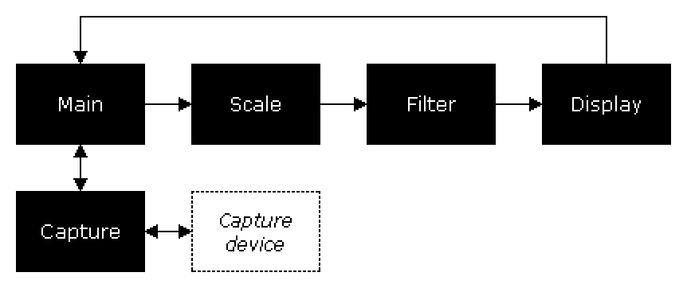

# Introduction to VCS's documentation for developers

This collection of documentation aims to familiarize developers with the internal, code-level workings of [VCS](https://www.tarpeeksihyvaesoft.com/#vcs). It supplements the [VCS code repository](https://www.github.com/leikareipa/vcs/).

The documentation is currently work in progress.

# Layout of documentation

A common pattern in the VCS codebase is the use of translation units as pseudo-classes to encapsulate related functionality. In this pattern, a `.cpp` source file represents a class implementation, its static variables and functions the private members, and the functionality exposed in the corresponding header file its public API. For example, VCS's capture code is encapsulated as the "capture subsystem," implemented in a couple of source files and exposed and documented in [src/capture/capture.h](./file=src_capture_capture_h.html).

As such, header file documentation will give you an understanding of how the individual building blocks of VCS work and how they can be accessed in code. You can find an index of the header files included in this documentation [here](./index=files.html) or by clicking the "Files" link in the upper left corner.

Higher-level FAQ-like documentation is available in the form of [guides](./index=guides.html), which aim to provide practical <i>how-to</i>s for working with the VCS codebase.

Finally, there's documentation on [VCS's data structures](./index=data_structures.html). This part of the docs is particularly not well fleshed out yet, but it might be a useful reference in some cases.

A future version of the docs will include search functionality, but for now it's not available.

# Overview of program flow

VCS is a generally single-threaded application whose program flow can be represented like so:

The program's main loop in Main polls [Capture](./file=src_capture_capture_h.html) for capture events, which in turn polls the capture device via a hardware API, and returns the events to Main. When a new captured frame is received from Capture, Main sends it to [Scaler](./file=src_scaler_scaler_h.html) for resizing, prior to which Scaler sends it to [Filter](./file=src_filter_filter_h.html) for the application of any active pixel effects. The scaled frame is then forwarded to [Display](./file=src_display_display_h.html), which presents it to the user. Program control returns to Main, which polls Capture for new capture events.
