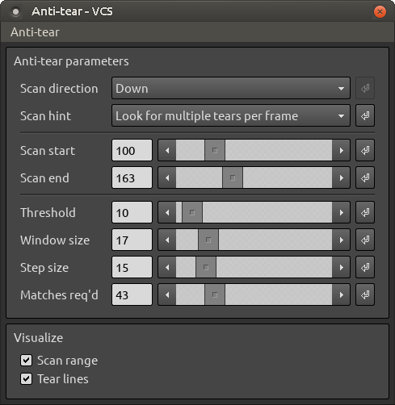
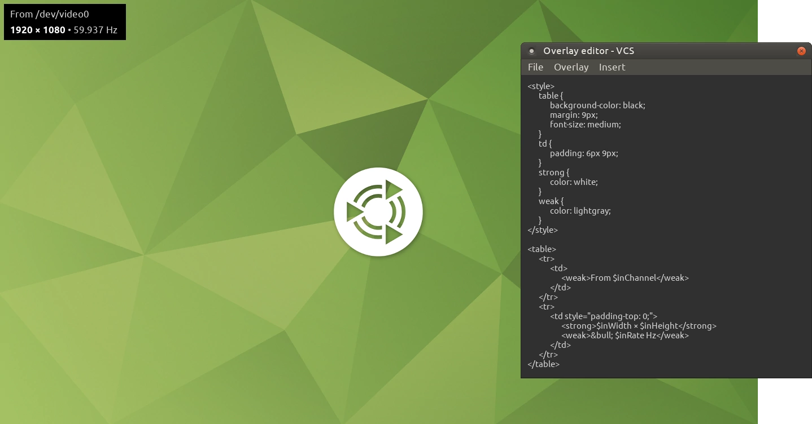
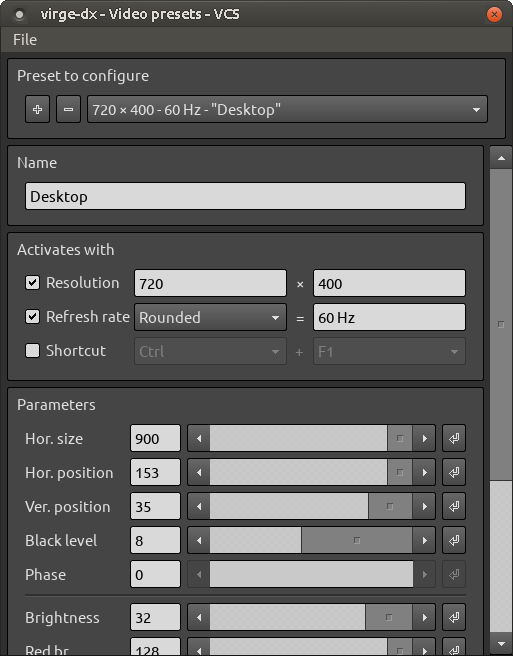

# Dialog windows

## Alias resolutions dialog

This dialog can be accessed with <menu-path>Context > Input > Aliases...</menu-path>.

With the alias resolutions dialog, you can instruct VCS to automatically override certain capture resolutions.

For instance, if you find that your capture device is displaying 640 &times; 400 as 512 &times; 488 (or something to that effect), you can define 640 &times; 400 as an alias of 512 &times; 488. Whenever the capture device reports a new video mode of 512 &times; 488, VCS will tell the device to use 640 &times; 400, instead.

## Anti-tear dialog

This dialog can be accessed with <key-combo>Ctrl + A</key-combo> or <menu-path>Context > Output > Anti-tear...</menu-path>.

> A screenshot of the anti-tear dialog\

The anti-tear dialog provides functionality to remove tearing from captured frames.

Under some circumstances, like when the captured source doesn't sync its rendering with the refresh rate, captured frames can contain tearing. VCS's anti-tearer helps mitigate this issue.

Anti-tearing should be considered an experimental feature of VCS. It works well in some cases and not that well in others. It'll completely fail to work if the captured source redraws the screen at a rate higher than the capture's refresh rate &ndash; e.g. a game running at 100 FPS with a refresh of 60 Hz.

### Settings explained

<dokki-table headerless>
    <table>
        <tr>
            <th>Setting</th>
            <th>Description</th>
        </tr>
        <tr>
            <td>Scan start</td>
            <td>
                Set where the anti-tearer begins scanning each frame for tears. Static screen-wide content like a game's UI bar can prevent the anti-tearing from working, so you should set this value so that such content is excluded. You can choose to visualize the scan range to help you set it up.
            </td>
        </tr>
        <tr>
            <td>Scan end</td>
            <td>
                Same as <strong>Scan start</strong> but for where the scanning should end. This is an offset from the bottom of the screen up, so e.g. a value of 5 at a resolution of 640 &times; 480 would mean the scanning ends at pixel row 475.
            </td>
        </tr>
        <tr>
            <td>Scan direction</td>
            <td>
                If the captured source redraws its screen from bottom to top, set the scan direction to <em>Down</em>. Otherwise, use the <em>Up</em> setting. Using the wrong direction will fully prevent the anti-tearing from working (it may correctly detect tears but won't be able to remove them).
            </td>
        </tr>
        <tr>
            <td>Scan hint</td>
            <td>
                If the captured source redraws its screen at a rate higher than half of its refresh rate but lower than the full refresh rate (e.g. 35 FPS at 60 Hz), you may (or might not) have better results and/or performance by setting this option to <em>Look for one tear per frame</em>. Otherwise, use the <em>Look for multiple tears per frame</em> setting.
            </td>
        </tr>
        <tr>
            <td>Visualization</td>
            <td>
                Draw certain anti-tearing-related markers in the <a href="#output-window">output window</a>.
            </td>
        </tr>
        <tr>
            <td>Threshold</td>
            <td>
                The anti-tearer compares adjacent frames to find which parts of the new frame may be torn (where pixels from the previous frame are still visible). This setting controls the amount by which a pixel's color values are allowed to change between frames without the pixel being considered new (given inherent noise in analog pixels). In an ideal situation where there's no noise in the captured signal, you can set this to 0 or close to it. Otherwise, the value should be high enough to exclude capture noise.
            </td>
        </tr>
        <tr>
            <td>Window size</td>
            <td>
                When scanning frames for tears, the anti-tearer will average together a bunch of horizontal pixels' color values to reduce the negative effect of analog noise. This setting controls the pixel size of the sampling window. Lower values will result in better performance but possibly worse tear detection.
            </td>
        </tr>
        <tr>
            <td>Step size</td>
            <td>
                The number of pixels to skip horizontally when scanning for tears. Higher values will improve performance but may cause a failure to detect subtler tears.
            </td>
        </tr>
        <tr>
            <td>Matches req'd</td>
            <td>
                Set how many times the sampling window must find a pixel's color values to have exceeded the detection threshold for a horizontal row of pixels to be considered new relative to the previous frame. Higher values should reduce the chance of false positives but may also cause a failure to detect subtler tears.
            </td>
        </tr>
    </table>
</dokki-table>

## Filter graph dialog

This dialog can be accessed with <key-combo>Ctrl + F</key-combo> or <menu-path>Context > Output > Filter graph...</menu-path>.

> The filter graph dialog showing a chain of frame filters\

The filter graph dialog lets you to create chains of image filters to be applied to captured frames prior to display in the [output window](#output-window).

The filter graph is made up of nodes that can be connected together in a chain. These nodes come in three varieties: *input gate*, *output gate*, and *filter*.

The input and output gates determine the resolutions for which the connected filters will be applied. For instance, if you set an input gate's width and height to 640 and 480, and the width and height of an output gate to 1920 and 1080, any filters you connect between these two nodes will be applied when the size of the output window is 1920 &times; 1080 and the original resolution of the frames (i.e. the capture resolution) is 640 &times; 480. You can also use the value 0 for a gate's width and/or height to allow VCS to match any value to that dimension: an input gate with a width and height of 0, for instance, will apply the connected filters to frames of all capture resolutions, provided that they also meet the resolution specified for the output gate. A filter graph can have multiple chains of these input-filter-output combos, and VCS will select the most suitable one (or none) given the current capture and output resolutions.

<dokki-tip>
    

        When deciding which of multiple filter chains to use, VCS will prefer more specific chains to more general ones.
    

    

        If you have e.g. an input gate whose width and height are 0, and another input gate whose width and height are 640 and 480, the latter will be used when the capture resolution is exactly 640 &times; 480, and the former otherwise.
    

    

        Likewise, if your input gates are 0 &times; 0 and 640 &times; 0, the former will be applied for capture resolutions of <i>any</i> &times; <i>any</i>, except for 640 &times; <i>any</i>, where the latter chain will apply &ndash; except if you also have a third input gate of 640 &times; 480, in which case that will be used when the capture resolution is exactly 640 &times; 480.
    

</dokki-tip>

To connect two nodes, click and drag with the left mouse button from one node's output edge (square) to another's input edge (circle), or vice versa. A node can be connected to as many other nodes as you like. To disconnect a node from another, right-click on the node's output edge, and select the other node from the list that pops up. To remove a node itself from the graph, right-click on the node and select to remove it. To add nodes to the graph, right-click on the graph's background to bring up the node menu, or select <menu-path>Filters</menu-path> from the dialog's menu bar.

## Input resolution dialog

This dialog can be accessed with <key-combo>Ctrl + I</key-combo> or <menu-path>Context > Input > Resolution...</menu-path>.

Normally, the capture device will automatically set the capture resolution to match that of the input signal, but sometimes the result isn't quite right. The input resolution dialog lets you override this resolution with your own one.

You can change a button's assigned resolution by clicking on it while pressing the <key-combo>Alt</key-combo> key.

## Output resolution dialog

This dialog can be accessed with <key-combo>Ctrl + O</key-combo> or <menu-path>Context > Output > Resolution...</menu-path>.

The output resolution dialog lets you resize the [output window](#output-window). This also resizes the frames being displayed in the window.

### Settings explained

<dokki-table headerless>
    <table>
        <tr>
            <th>Setting</th>
            <th>Description</th>
        </tr>
        <tr>
            <td>Resolution</td>
            <td>
                Lock the size of the output window so that changes to the capture resolution don't affect the output
                resolution. Frames will be scaled up or down as needed to match this resolution.
            </td>
        </tr>
        <tr>
            <td>Relative scale</td>
            <td>
                Scale the size of the output window up or down by a percentage of its base size. The base size is
                either the capture resolution, or, if enabled, the locked output resolution.
            </td>
        </tr>
    </table>
</dokki-table>

## Overlay editor dialog

This dialog can be accessed with <key-combo>Ctrl + L</key-combo> or <menu-path>Context > Output > Overlay editor...</menu-path>.

> The overlay editor dialog (right) showing the HTML/CSS source of an overlay (top left) in this capture of a Linux desktop\

The overlay dialog lets you define a message to be overlaid on the [output window](#output-window).

You can combine normal text with pre-set VCS variables and HTML/CSS formatting to create a message to be shown over the output window.

## Video presets dialog

This dialog can be accessed with <key-combo>Ctrl + V</key-combo> or <menu-path>Context > Input > Video presets...</menu-path>.

> A screenshot of the video presets dialog\

The video presets dialog lets you to modify the capture devices's video signal parameters.

A given video preset's parameters will be applied when all of its "Activates with" conditions are met. For instance, if you've defined a preset's activation resolution as 800 &times; 600 and have disabled the other activating conditions, the preset's parameters will be applied when the capture video mode is 800 &times; 600.

To add or delete a preset, click the + or - buttons next to the preset selector at the top of the dialog. Clicking the + button while holding the Alt key will create a new preset with the current preset's settings.

If you want your changes to the video presets to persist after you exit VCS, remember to save them first! This can be done via <menu-path>File > Save as&hellip;</menu-path>. Saved settings can be restored via <menu-path>File > Open&hellip;</menu-path>. Any saved settings that're open when VCS exits will be reloaded automatically when you run VCS again.

## Video recorder dialog

This dialog can be accessed with <key-combo>Ctrl + R</key-combo> or <menu-path>Context > Output > Video recorder...</menu-path>.

<dokki-warning>
    Video recording is not available while using an [output scaling filter](#dialog-windows-filter-graph-dialog).
</dokki-warning>

<dokki-warning>
    On Linux, the video encoder's quality settings can't be modified through VCS &ndash; you'd need to re-compile OpenCV with your desired encoder settings, instead.
</dokki-warning>

The video recorder gives you the option to stream captured frames into a video file.

To use the video recorder in Windows, you'll need to install the 32-bit version of the [x264vfw](https://sourceforge.net/projects/x264vfw/files/x264vfw/44_2851bm_44825/) codec and run its configurator at least once, so that its settings are added into the Windows registry for VCS to find.

The recorder will write frames as they appear in the [output window](#output-window) into a video file, with the following caveats:

- The maximum supported resolution is 1024 &times; 768.
- Audio won't be recorded.
- Frames will be inserted into the video at the rate of capture; the recorder doesn't try to maintain any particular frame rate (e.g. by duplicating or dropping frames). For example, if your capture source is 57.5 Hz, one minute of video will have 57.5 * 60 frames, and if that video is played back at 60 FPS, it will appear slightly sped up.
- If VCS drops any frames during recording (e.g. due to insufficient system performance), the video's playback will be non-linear. So if you're recording a separate audio file and are planning to sync it with the video, you want there to be no frames dropped while recording the video.
- The video will be recorded in the H.264 format using an x264 codec.
- The video resolution will be that of the current output size (see the [Output resolution](#output-resolution-dialog) dialog).
- The output size can't be changed while recording; all frames will be scaled automatically to fit the current size.
- The [overlay](#overlay-editor-dialog) won't be recorded.
- Encoder parameters influencing image quality (e.g. CRF) can't be customized in the Linux version of VCS. This is a limitation of OpenCV. You can, however, modify and recompile the OpenCV code with higher-quality default options (see e.g. [here](https://www.researchgate.net/post/Is_it_possible_to_set_the_lossfree_option_for_the_X264_codec_in_OpenCV)).

### Settings explained

<dokki-table headerless>
    <table>
        <tr>
            <th>Setting*</th>
            <th>Description</th>
        </tr>
        <tr>
            <td>Nominal FPS</td>
            <td>
                The video's suggested playback rate. This setting doesn't affect the recording rate, only the rate at which the video might be played back by your video player. The actual recording FPS will be determined by the capture source's refresh rate.
            </td>
        </tr>
        <tr>
            <td>Video container</td>
            <td>
                The file format used for storing the video on disk.
            </td>
        </tr>
        <tr>
            <td>Video codec</td>
            <td>
                The codec used for encoding the video. Currently, only <em>x264</em> is supported.
            </td>
        </tr>
        <tr>
            <td>Arguments</td>
            <td>
                You can enter any additional command-line arguments for the video codec.
            </td>
        </tr>
        <tr>
            <td colspan="2">
                *Only some of the available settings are included in this list; others depend on the choice of video codec and are as per standard for that codec (e.g. CRF for x264).
            </td>
        </tr>
    </table>
</dokki-table>

### Settings for the highest video quality

The following video recorder settings should result in the highest possible output video quality.

<dokki-table headerless>
    <table>
        <tr>
            <th>Setting</th>
            <th>Value</th>
        </tr>
        <tr>
            <td>Video codec</td>
            <td><em>x264</em></td>
        </tr>
        <tr>
            <td>Profile</td>
            <td><em>High 4:4:4</em></td>
        </tr>
        <tr>
            <td>Pixel format</td>
            <td><em>RGB</em></td>
        </tr>
        <tr>
            <td>CRF</td>
            <td><em>0</em>*</td>
        </tr>
        <tr>
            <td colspan="2">
                *Increasing the CRF value to 10&ndash;14 will considerably reduce the size of the resulting video file while maintaining high image quality.
            </td>
        </tr>
    </table>
</dokki-table>

### Tips for performance

If the recorder dialog indicates that frames are being dropped while recording, your system may be limited in CPU or disk performance. Here are a few tips that may help you mitigate those issues.

Since VCS is largely a single-threaded program, dragging or otherwise interacting with its GUI items (e.g. dialog windows) during recording may cause transient frame drops even if your system is otherwise capable.  

During recording, frames are saved to disk in batches. If you get a bunch of frames droppede very couple of seconds but are fine otherwise, insufficient disk performance may be the reason. Optimizing the recorder's settings for a smaller file size should help, as would recording at a lower resolution (i.e. with a smaller-sized [output window](#output-window).

If recording fails and you receive an error in the VCS console window to the tune of "x264 [error]: malloc of size ░ failed", you may be running into a memory fragmentation issue (see [this issue report on GitHub](https://github.com/leikareipa/vcs/issues/21)). VCS is a 32-bit program that, while recording video, shares its couple-gigabyte memory space with the x264 encoder, which may result in x264 being unable to allocate a large-enough contiguous block of memory for its own operation. You may be able to fix this issue either by selecting a <em>Preset</em> option closer to "Ultrafast", reducing the recording resolution (i.e. the size of the output window), or decreasing the size of VCS's pre-allocated memory cache (see the <em>-m</em> [command-line option](#command-line-options)).
