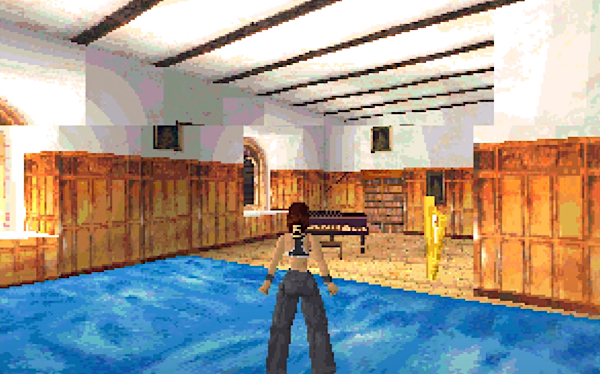

# FAQ

In this section, you'll find answers to some of the common questions and problems that one might have when using VCS.

## Getting started

A download for the latest Windows version of VCS is [available on GitHub](https://github.com/leikareipa/vcs/releases). For Linux, you can grab the [VCS source code](https://github.com/leikareipa/vcs/) and compile it for your platform.

Assuming you've already installed the drivers for your capture device, simply run *vcs.exe* to get started with VCS.

When you run the VCS executable, two windows should open: a console window, in which notifications about VCS's status will appear during operation; and the [capture window](#output-window), in which captured frames are displayed.

<dokki-tip>
    You can use VCS's <a href="#command-line-options">command-line options</a> to automate certain start-up tasks.
</dokki-tip>

## Adjusting the color balance

The capture hardware may not always provide an accurate color balance by default.

To correct this, you can use the [Video presets dialog](#dialog-windows-video-presets-dialog) to manually adjust the balance, then save the settings to be applied automatically next time you run VCS in this video mode.

## Reducing visual noise

When capturing an analog source, some visual noise is to be expected. VCS comes with a few ways to mitigate this.

The first thing to check is that you have suitable analog capture parameters set, using the [Video presets dialog](#dialog-windows-video-presets-dialog). The *phase* setting is especially important to get right. What the exact correct settings are depends on your capture source and can't be pre-determined, so simply adjust them until the output looks correct. You can use the capture window's magnifying glass (see [Capture window: Features](#output-window-features)) to inspect the output in closer detail. Once you're happy with the settings, you can save them to be applied automatically next time.

Depending on the capture source, some noise may be present regardless of the capture parameters, in which case you can apply [frame filtering](#dialog-windows-filter-graph-dialog) to reduce the noise further. The *Denoise (pixel gate)* filter can be used to eliminate pixel shimmer; and there's also the more powerful &ndash; but more performance-hungry &ndash; *Denoise (non-local means)* filter. If you're capturing a line-doubled source (e.g. VGA mode 13h), you can apply a 1&times; *Decimate* filter to remove sub-pixel noise. The *Delta histogram* filter will produce a visual indication of the amount of noise present, allowing you to better estimate the effect of the various filters (just make sure that this histogram filter is the last one in the filter chain, so that it sees the changes from the other filters).

## Fixing an incorrect capture resolution

The capture hardware may not always correctly sense the resolution of the input signal, resulting in the displaying of malformed frames in VCS's [capture window](#output-window) and/or the reporting of an incorrect input resolution in the capture window's [title bar](#output-window-title-bar).

You can use the [Input resolution dialog](#dialog-windows-input-resolution-dialog) to manually correct the resolution.

If you find that a particular resolution is consistently misidentified by the capture hardware, you can have VCS correct it automatically via the [Alias resolutions dialog](#dialog-windows-alias-resolutions-dialog).

## Resizing the capture window

The size of the capture window can be changed via the [Output resolution dialog](#dialog-windows-output-resolution-dialog).

## Preventing the capture window from resizing

You can use the [Output resolution dialog](#dialog-windows-output-resolution-dialog) to set a fixed resolution for the capture window. All captured frames will then be scaled automatically to that resolution using the currently-active scaler. (To customize the scaler, use the <menu-path>Context > Output > Upscaler</menu-path> and <menu-path>Context > Output > Downscaler</menu-path> menu options.)

## Entering fullscreen mode

VCS supports two fullscreen modes: windowed fullscreen, and true fullscreen. In most cases, the windowed fullscreen mode is recommended, but the true fullscreen mode may be needed for variable refresh rate output.

### Windowed fullscreen

To enter windowed fullscreen mode, first use the [Output resolution dialog](#dialog-windows-output-resolution-dialog) to set the resolution of the capture window to the size of your screen, then press the <key-combo>F1</key-combo> key (or use the <menu-path>Context > Window > Border<menu-path> menu option) to set the capture window into borderless mode. While in borderless mode, the window will be positioned on top of other desktop elements (e.g. windows and task bars).

### True fullscreen

To enter true fullscreen mode, first use the [Output resolution dialog](#dialog-windows-output-resolution-dialog) to set the resolution of the capture window to the size of your screen, then press the <key-combo>F11</key-combo> key to place the window into fullscreen mode.

### Aspect ratio

To ensure that the capture window displays frames in their correct aspect ratio while in either of the fullscreen modes, select the <menu-path>Context > Output > Aspect ratio > Traditional 4:3</menu-path> menu option.

## Enabling variable refresh rate output

If you hardware supports variable refresh rate output with OpenGL, VCS should be able to take advantage of it.

First, select the <menu-path>Context > Window > Render using > OpenGL</menu-path> menu option to enable OpenGL rendering, then press the <key-combo>F11</key-combo> key to enter fullscreen mode (see [Entering fullscreen mode](#faq-entering-fullscreen-mode) for caveats). Your hardware's refresh rate should now be matched to the capture's refresh rate.

## Reducing screen tearing

With some capture sources (e.g. DOS-mode VGA), you may find the image susceptible to tearing. This kind of tearing is present in the output signal and doesn't result from the capture process &ndash; you'd see it even if you were viewing the output directly through a monitor.

> Screen tearing in Tomb Raider (DOS)\

To reduce or even eliminate tearing of this sort, VCS provides anti-tearing functionality. See [Anti-tear dialog](dialog-windows-anti-tear-dialog) for more information.

> Before (left) and after (right) applying VCS's anti-tearing\

