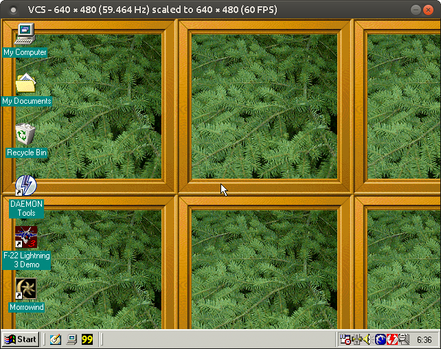
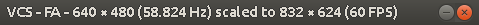

# Output window

The central point of the VCS user interface is the output window, where captured frames are displayed as they arrive from the capture device and having undergone any of VCS's filtering and scaling.

> A screenshot of the output window\

## Features

### Magnifying glass

If you press the middle mouse button over the output window, a magnifying glass will pop up, showing an elarged view of the area around the cursor.

<dokki-tip>
    The magnifying glass feature isn't available while using the OpenGL renderer.
</dokki-tip>

### Dragging

You can drag the output window by left-clicking and holding anywhere on the window.

### Borderless mode

You can double-click inside the output window to toggle borderless mode on/off. The <key-combo>F1</key-combo> key will also toggle this mode.

### Resizing

The output window &ndash; along with the frames it's displaying &ndash; can be resized via the [Output resolution](#output-resolution-dialog) dialog. Spinning the mouse scroll wheel over the output window will also adjust the output size.

### Fullscreen mode

Although you can emulate a fullscreen mode by turning off the output window's border and then scaling the window to the size of the the display area, there's also a true fullscreen mode available. You can toggle it on/off with the <key-combo>F11</key-combo> key.

<dokki-warning>
    For the fullscreen mode to work best, you may first need to manually resize the output window to match the resolution of your screen.
</dokki-warning>

## Title bar

The output window's title bar shows information about VCS's current operating state &ndash; for example, the input and output resolution.

> A sample of the output window's title bar on Linux\

The title bar may contain some or all of the following elements, from left to right:

<dokki-table headerless>
    <table>
        <tr>
            <th>Element</th>
            <th>Desription</th>
        </tr>
        <tr>
            <td>{!}</td>
            <td>
                The frame drop indicator. Shown when VCS is having to drop captured frames due to insufficient performance (e.g. the CPU not being fast enough for the current capture settings).
            </td>
        </tr>
        <tr>
            <td>VCS</td>
            <td>
                The program's name.
            </td>
        </tr>
        <tr>
            <td>RFOA</td>
            <td class="with-inline-table">
                <dokki-table>
                    <table>
                        <tr>
                            <th>Element</th>
                            <th>Explanation</th>
                        </tr>
                        <tr>
                            <td>R</td>
                            <td>
                                Shown when video recording is active (see <a href="#video-record-dialog">Video recorder dialog</a>)
                            </td>
                        </tr>
                        <tr>
                            <td>F</td>
                            <td>
                                Shown when the filter graph is active (see <a href="#filter-graph-dialog">Filter graph dialog</a>)
                            </td>
                        </tr>
                        <tr>
                            <td>O</td>
                            <td>
                                Shown when the overlay is active (see <a href="#overlay-dialog">Overlay dialog</a>)
                            </td>
                        </tr>
                        <tr>
                            <td>A</td>
                            <td>
                                Shown when anti-tearing is active (see <a href="#anti-tear-dialog">Anti-tear dialog</a>)
                            </td>
                        </tr>
                    </table>
                </dokki-table>
            </td>
        </tr>
        <tr>
            <td>░ &times; ░ (░ Hz)</td>
            <td>
                The current capture resolution and its refresh rate.
            </td>
        </tr>
        <tr>
            <td>scaled to ░ &times; ░ (░ FPS)</td>
            <td>
                The current output resolution and the rate at which the output is being updated.
            </td>
        </tr>
    </table>
</dokki-table>

Under special circumstances, the title bar may also show one of these messages:

<dokki-table headerless>
    <table>
        <tr>
            <th>Message</th>
            <th>Reason</th>
        </tr>
        <tr>
            <td>No signal</td>
            <td>
                The capture device doesn't appear to be receiving a signal.
            </td>
        </tr>
        <tr>
            <td>Signal out of range</td>
            <td>
                Either VCS or the capture device is unable to process the signal's video mode due to the mode exceeding operating parameters. For example, the input resolution may be too high.
            </td>
        </tr>
        <tr>
            <td>Invalid capture channel</td>
            <td>
                The requested input channel on the capture device, or the entire capture device, is unavailable for use. This could be caused e.g. by an out-of-range input channel index or the capture device driver not being installed.
                <dokki-tip>
                    On Linux, the Datapath Vision driver must be re-installed whenever your kernel is updated &ndash; failure to do so will result in this error message. Sometimes a kernel update will break compatibility with the driver, so ensure that the driver installer finishes successfully.
                </dokki-tip> 
            </td>
        </tr>
    </table>
</dokki-table>

## Context menu

Right-clicking inside the output window will bring up its context menu, which gives you access to the various controls and dialogs of VCS.

### Eye dropper

The eye dropper is a special non-interactible element of the context menu. It shows the RGB color values of the pixel over which the context menu was opened.

### Input

The input menu lets you customize various operational parameters of the capture device. The menu provides the following options:

<dokki-table headerless>
    <table>
        <tr>
            <th>Option</th>
            <th>Explanation</th>
        </tr>
        <tr>
            <td>Channel</td>
            <td>
                Set the capture device's active input channel.
            </td>
        </tr>
        <tr>
            <td>Color depth</td>
            <td>
                Set the color depth in which the capture device outputs frames. In other words, the device is expected to convert frame data into this format prior to transferring them via the system bus to VCS. Prior to display, VCS will convert the data into the color depth of the <a href="#output-window">output window</a>.
            </td>
        </tr>
        <tr>
            <td>De-interlacing</td>
            <td>
                Set the hardware-side de-interlacing mode for interlaced signals. This setting is expected to have no effect on non-interlaced signals.
            </td>
        </tr>
    </table>
</dokki-table>
        
### Output

The output menu lets you customize the way in which VCS processes captured frames prior to display in the [output window](#output-window). The menu provides the following options:

<dokki-table headerless>
    <table>
        <tr>
            <th>Option</th>
            <th>Explanation</th>
        </tr>
        <tr>
            <td>Screenshot</td>
            <td>
                Save the current output image into an image file.
            </td>
        </tr>
        <tr>
            <td>Aspect ratio</td>
            <td class="with-inline-table">
                <dokki-table>
                    <table>
                        <tr>
                            <th>Sub-option</th>
                            <th>Explanation</th>
                        </tr>
                        <tr>
                            <td>Native</td>
                            <td>
                                Don't force captured frames into a specific aspect ratio.
                            </td>
                        </tr>
                        <tr>
                            <td>Traditional 4:3</td>
                            <td>
                                Force captured frames into a 4:3 aspect ratio for such input resolutions that historically might have been meant to be displayed as such; for example, 720 &times; 400, 640 &times; 400, and 320 &times; 200.
                            </td>
                        </tr>
                        <tr>
                            <td>Always 4:3</td>
                            <td>
                                Force all captured frames into a 4:3 aspect ratio.
                            </td>
                        </tr>
                    </table>
                </dokki-table>
            </td>
        </tr>
        <tr>
            <td>Upscaler</td>
            <td>
                Set the scaler to be used when frames are upscaled to fit the output window.
            </td>
        </tr>
        <tr>
            <td>Downscaler</td>
            <td>
                Set the scaler to be used when frames are downscaled to fit the output window.
            </td>
        </tr>
    </table>
</dokki-table>
        
### Window

The window menu lets you customize various properties of the [output window](#output-window). The menu provides the following options:

<dokki-table headerless>
    <table>
        <tr>
            <th>Option</th>
            <th>Explanation</th>
        </tr>
        <tr>
            <td>Renderer</td>
            <td class="with-inline-table">
                <dokki-table>
                    <table>
                        <tr>
                            <th>Sub-option</th>
                            <th>Explanation</th>
                        </tr>
                        <tr>
                            <td>Software</td>
                            <td>
                                Draw the window using software rendering. Performs well and supports the most features, but may not allow variable refresh rate output.
                            </td>
                        </tr>
                        <tr>
                            <td>OpenGL</td>
                            <td>
                                

                                    Draw the window using OpenGL. Allows variable refresh rate output (if supported by your hardware), but is incompatible with Windows XP and the magnifying glass feature.
                                

                            </td>
                        </tr>
                    </table>
                </dokki-table>
            </td>
        </tr>
        <tr>
            <td>Border</td>
            <td>
                A hint to the operating system on whether to decorate the output window with the system's window border and title bar. When the window is in borderless mode, the operating system is also asked to position it on top of other desktop elements. You can achieve a windowed fullscreen mode by disabling the window border and setting the <a href="#output-resolution-dialog">Output resolution</a> to match your desktop resolution (see also the <em>Top left</em> menu option).
            </td>
        </tr>
        <tr>
            <td>Fullscreen</td>
            <td>
                Place the output window into fullscreen mode. For best results, you should first scale the window to the resolution of your screen before entering fullscreen mode. Not fully supported on some distributions of Linux.
            </td>
        </tr>
        <tr>
            <td>Center</td>
            <td>
                Snap the output window to the middle of the screen.
            </td>
        </tr>
        <tr>
            <td>Top left</td>
            <td>
                Snap the output window to the top left corner of the screen.
            </td>
        </tr>
        <tr>
            <td>Set title...</td>
            <td>
                Give the output window a custom title. All of VCS's normal title bar information - except the frame drop indicator - will be replaced with the text you set. Setting an empty string will restore VCS's default title bar.
            </td>
        </tr>
    </table>
</dokki-table>
