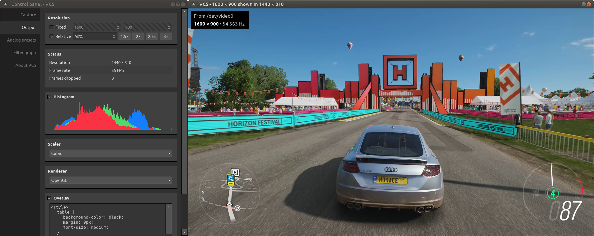
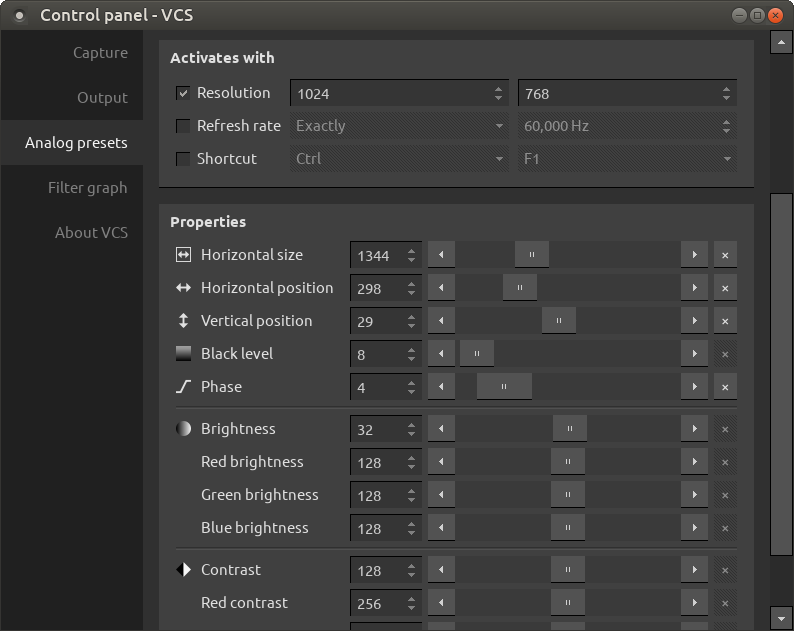

# User's manual for VCS

## Table of contents

*Todo*

## Introduction

VCS is an [open-source](https://github.com/leikareipa/vcs) control application for Datapath Vision capture cards on Linux.

\
*A screenshot of VCS 3.0 showing the capture window (right) and some of the control options (left)*

### Key features

- Unlimited video presets for analog capture
- Several scaling modes and image filters
- Variable refresh rate output

### Supported capture hardware

Any model of Datapath capture card supported by the Datapath Vision driver for Linux should be compatible, although the card's full set of capabilities may not be exposed.

### System requirements

<table>
    <tr>
        <th>OS</th>
        <td>A version of Linux supported by Datapath's Vision Linux driver</td>
    </tr>
    <tr>
        <th>CPU</th>
        <td>Intel Sandy Bridge or equivalent (Coffee Lake or better recommended)</td>
    </tr>
    <tr>
        <th>GPU</th>
        <td>
            For optional hardware rendering, an OpenGL 1.2 compatible graphics card
        </td>
    </tr>
    <tr>
        <th>RAM</th>
        <td>VCS will use up to 1 GB of RAM</td>
    </tr>
</table>

## FAQ

### Q: Where do I download VCS?

A: VCS is available from GitHub: https://github.com/leikareipa/vcs/. Pre-built binaries may not be available.

### Q: How do I adjust the picture?

A: There are three complementary ways to control how captured frames are displayed.

1. To adjust phase, color balance, etc. in analog capture, access the analog capture settings via Control panel &rarr; Analog presets.
2. To scale the output image, see Control panel &rarr; Output.
3. To force a different input resolution, see Control panel &rarr; Capture.

### Q: How do I fix analog noise?

A: In an analog signal, some amount of visual noise is always present, so VCS comes with a few ways to mitigate it.

1. See that your analog settings are correct, by accessing Control panel &rarr; Analog presets. You'll want to ensure that the *Horizontal size* and *Phase* parameters in particular are set to suitable values.
2. Use a denoising filter via Control panel &rarr; Filter graph.
3. When capturing a pixel-doubled signal (e.g. some VGA modes), use a decimating filter to remove sub-pixel noise.

### Q: How do I set the correct capture resolution?

A: Sometimes the capture hardware fails to automatically determine the correct input resolution for the captured signal. You can help it by manually overriding the resolution via Control panel &rarr; Capture.

### Q: How do I change the aspect ratio?

A: There are two ways to control the output aspect ratio.

1. Set a fixed output resolution via Control panel &rarr; Output.
2. Use an output scaling filter via Control panel &rarr; Filter graph. This method allows optional letterboxing.

### Q: How do I enable variable refresh rate output?

A: VCS always outputs at the rate of capture, provided that your hardware can keep up.

If your monitor has variable refresh rate support, the rate you see will match the refresh rate of your capture source. For some implementations, you may need to adjust the settings in VCS to enable OpenGL rendering and/or fullscreen mode.

### Q: How do I fix screen tearing?

A: While VCS itself doesn't cause screen tearing, it may be present in captured frames. To reduce or even eliminate this kind of tearing, use the Anti-tearing filter via Control panel &rarr; Filter graph.

### Q: How much capture latency is there?

A: Compared to routing your video output directly into a monitor, there should be about a dozen milliseconds of extra latency, provided that you meet [VCS's recommended system requirements](#system-requirements).

## Output window

The output window displays captured frames after any scaling and image filtering has been applied to them.

\
*A screenshot of the output window in VCS 3.0 displaying a captured, upscaled frame*

### Magnifying glass 

Press the middle mouse button over the window to bring up a magnifying glass that shows an enlarged view of the output image.

This feature isn't available when using the OpenGL renderer.

### Borderless mode

Double-click the window to toggle borderless mode on/off.

### Resizing

The size of the window can be scaled up and down with the mouse scrollwheel. More accurate control is available via Control panel &rarr; Output.

### Context menu

Right-click the window to bring up a context menu that provides access to various settings.

## Control panel

The control panel lets you adjust various operational aspects of VCS.

\
*A screenshot of the control panel in VCS 3.0 showing analog capture settings*

Experiment   with the various controls to find out what they do.

## Keyboard shortcuts

<table>
    <tr>
        <th>Key(s)</th>
        <th>Description</th>
    </tr>
    <tr>
        <td><key-combo>Esc</key-combo></td>
        <td>Exit fullscreen mode.</td>
    </tr>
    <tr>
        <td><key-combo>F1</key-combo> to <key-combo>F12</key-combo></td>
        <td>Activate an analog video preset, if one is bound to this key.</td>
    </tr>
    <tr>
        <td><key-combo>Alt+Q</key-combo></td>
        <td>Open the Control panel.</td>
    </tr>
    <tr>
        <td><key-combo>Alt+S</key-combo></td>
        <td>Save the current output image to disk.</td>
    </tr>
    <tr>
        <td><key-combo>Ctrl+Shift+F</key-combo></td>
        <td>Toggle the filter graph on/off.</td>
    </tr>
    <tr>
        <td><key-combo>Ctrl+Shift+O</key-combo></td>
        <td>Toggle the overlay on/off.</td>
    </tr>
    <tr>
        <td><key-combo>Ctrl+1</key-combo> to <key-combo>Ctrl+9</key-combo></td>
        <td>
            Activate the corresponding resolution button in Control panel &rarr; Capture &rarr; Force resolution. The layout of the shortcut keys is that of the numpad, such that e.g. Ctrl+7 activates the top left button.
        </td>
    </tr>
    <tr>
        <td><key-combo>Shift+1</key-combo> <key-combo>Shift+2</key-combo></td>
        <td>Switch between /dev/video0 and /dev/video1.</td>
    </tr>
</table>

The above isn't an exhaustive list.

## Command-line options

<table>
    <tr>
        <th>Option</th>
        <th>Description</th>
    </tr>
    <tr>
        <td>-i <i>&lt;integer&gt;</i></td>
        <td>
            Start capture on the given input channel (1&#8230;<i>n</i>). On Linux, a value of 1 corresponds to <em>/dev/video0</em>, 2 to <em>/dev/video1</em>, 3 to <em>/dev/video2</em>, and so on. By default, channel 1 will be used.
        </td>
    </tr>
    <tr>
        <td>-v <i>&lt;string&gt;</i></td>
        <td>
            Load video presets from the given file on start-up. Video preset files typically have the .vcs-video suffix.
        </td>
    </tr>
    <tr>
        <td>-f <i>&lt;string&gt;</i></td>
        <td>
            Load a custom filter graph from the given file on start-up. Filter graph files typically have the .vcs-filter-graph suffix.
        </td>
    </tr>
</table>
